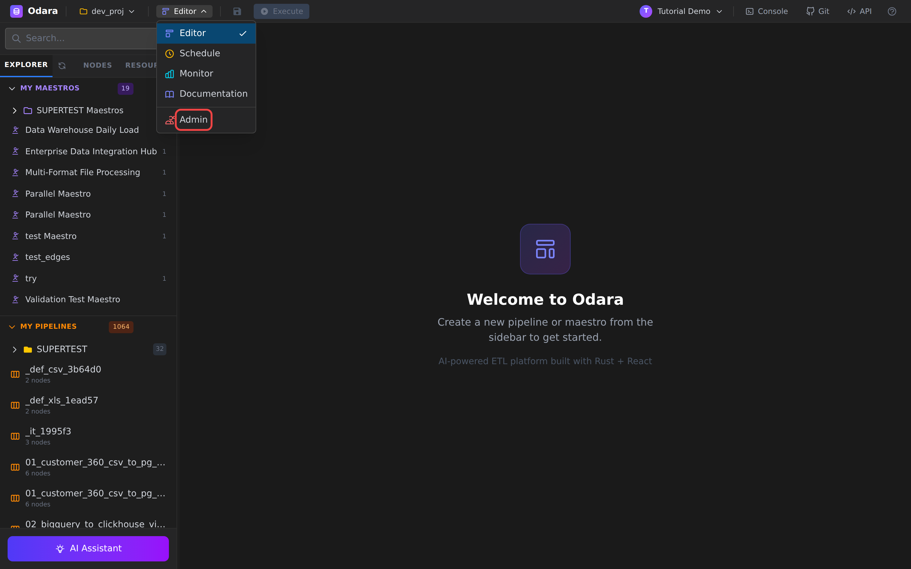
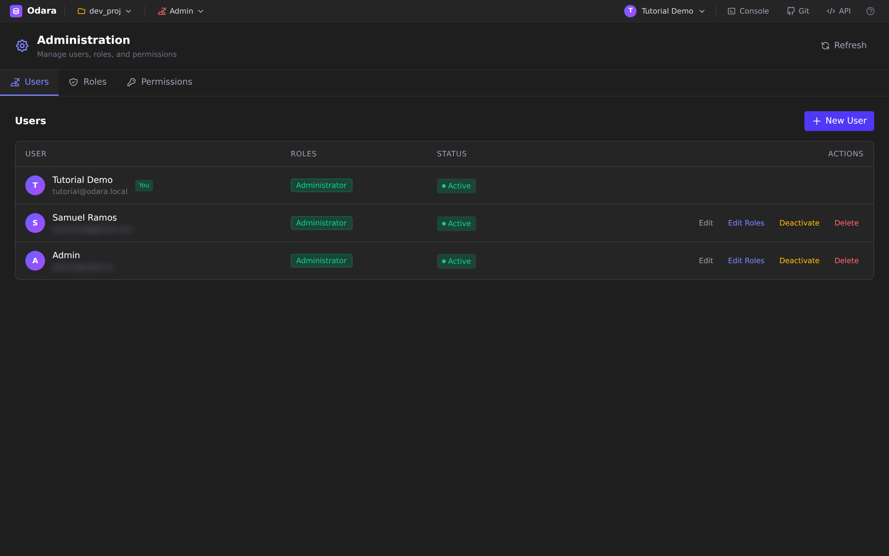
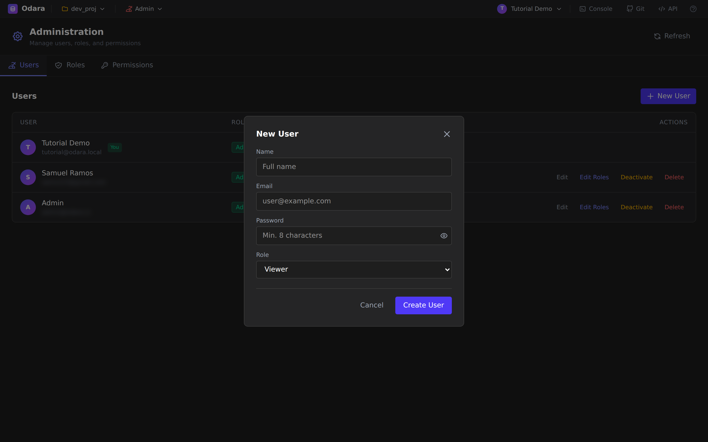
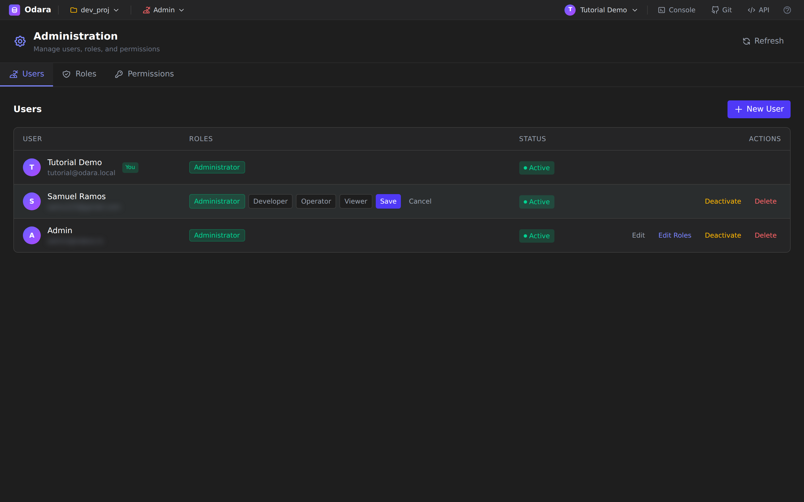
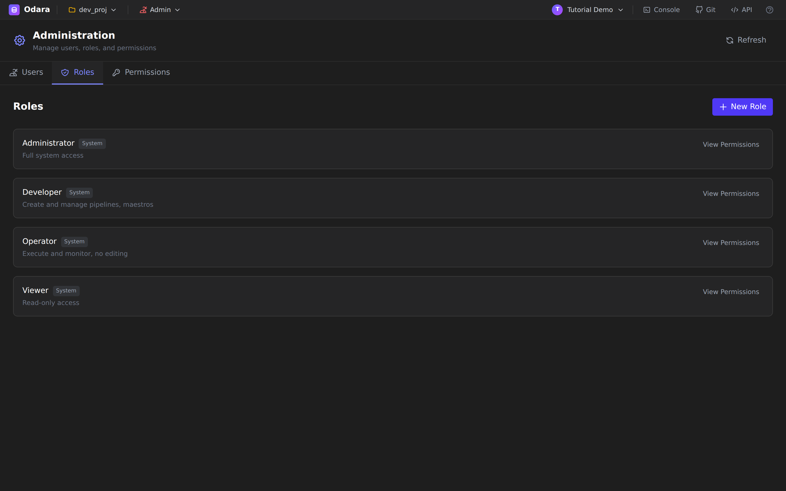
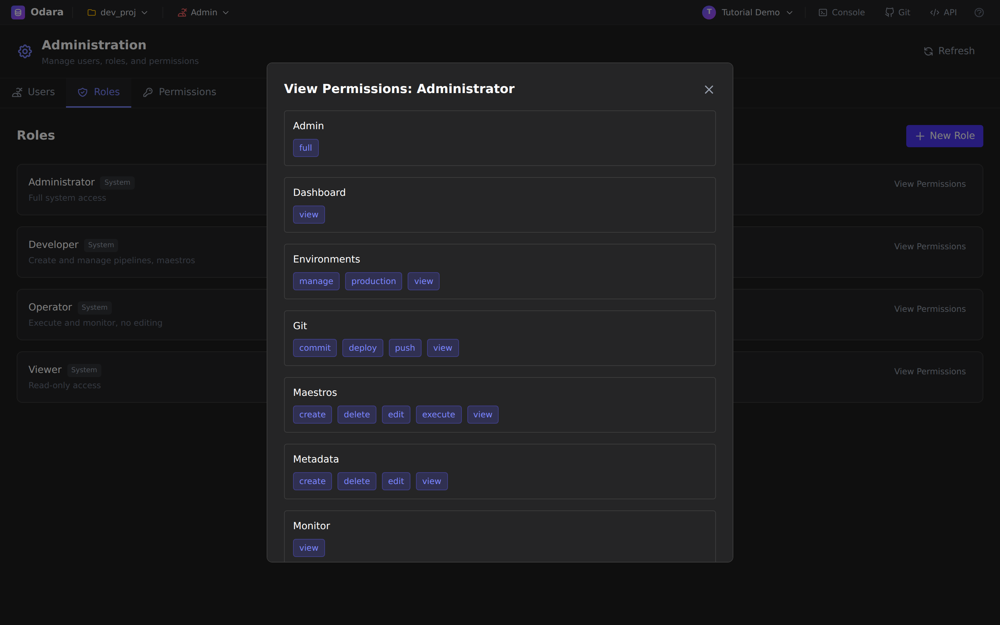
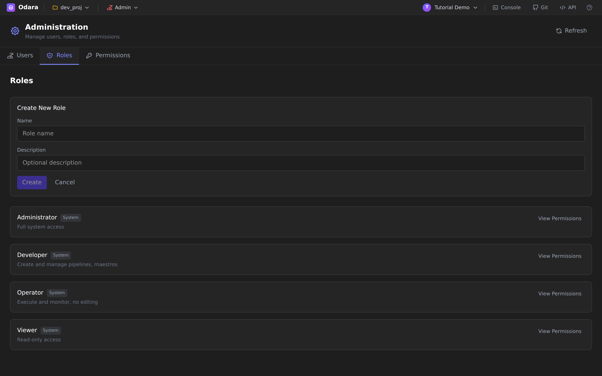
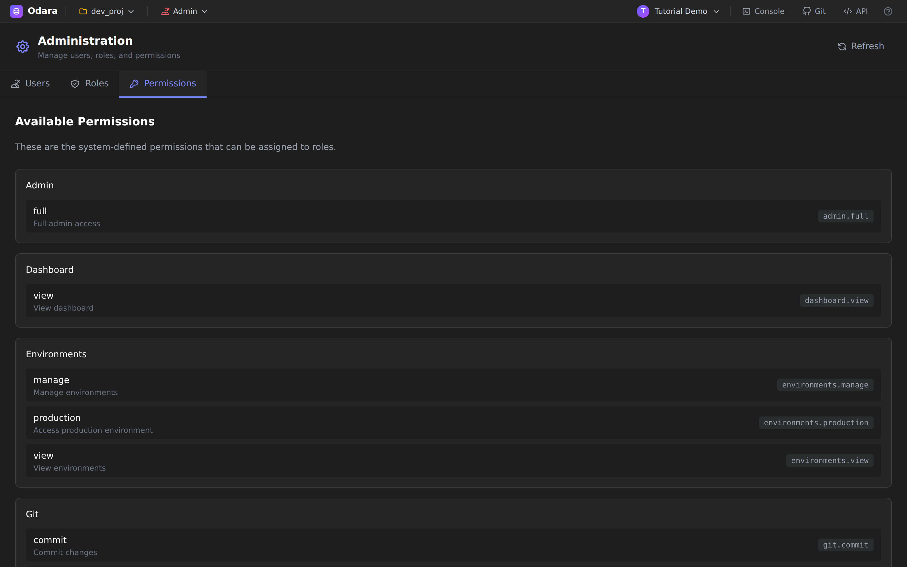

# Admin

> One line: **Admin** is the single screen where you decide *who can
> log into this Odara install* and *what they're allowed to do* —
> users in one tab, roles in another, and the catalog of permissions
> roles draw from in the third.

This tutorial walks through Admin end to end on a fresh install,
logged in as an **Administrator**. You'll learn how to:

1. Open Admin
2. Read the Users list
3. Create a new user
4. Change which roles a user has (inline editor)
5. Browse the Roles list and view a role's permissions
6. Create a custom role
7. Browse the catalog of available permissions

It takes about **8 minutes**.

> **You need to be an admin to follow this.** The Admin entry only
> appears in the Editor dropdown for users who hold the
> `Administrator` role. If you're following along on the bundled
> tutorial install, the `tutorial@odara.local` account has been
> upgraded to admin — on a real install, ask whoever set Odara up.

---

## 1. Open Admin

Sign in, then click the **Editor** dropdown in the top bar (between
the project selector and the user menu). The dropdown shows the
sections you have access to — for an admin, the bottom entry is
**Admin** (highlighted in red below).

Click it and Odara navigates to **Administration**. The page has
three tabs — **Users**, **Roles**, **Permissions** — and a **Refresh**
button at the top-right that re-fetches the list (useful if another
admin just made a change in a different browser).

---

## 2. The Users list

The first tab is **Users**. It shows everyone who can sign in to this
install.

Each row gives you:

| Column | What it tells you |
|---|---|
| **User** | Avatar with the initial, the user's display name, and their email. Your own row carries a green **You** pill. |
| **Roles** | The role chips assigned to this user (Administrator / Developer / Operator / Viewer, or any custom role). A user can hold more than one. |
| **Status** | `Active` (can sign in) or **Deactivated** (kept in the database for audit history, but can't sign in until reactivated). |
| **Actions** | Per-row links: **Edit** (name, email, password), **Edit Roles** (inline), **Deactivate** (toggles to **Activate** if already off), **Delete**. |

> In the screenshot above, other users' email addresses are blurred
> for privacy — on your install they appear as plain text.

---

## 3. Create a new user

Click the purple **+ New User** button in the top-right.

Fill four fields:

- **Name** — the display name shown across Odara (Monitor, Schedule
  alerts, audit logs, etc.).
- **Email** — used to sign in. Must be unique across the install.
- **Password** — minimum 8 characters. Stored as an **argon2id** hash;
  even an admin cannot retrieve it later — only reset it.
- **Role** — the **starting** role for the new user. Pick the least
  privileged role that lets them do their job; you can always add
  more roles later from the Users tab.

Click **Create User**. The new user appears at the bottom of the
list, **Active** and ready to sign in.

---

## 4. Edit roles — inline, not a modal

Unlike many admin panels, Odara edits roles **inline on the row**.
Click **Edit Roles** on any user (other than yourself) and the
**Roles** column transforms into a row of toggleable chips:

- Click a chip to add or remove that role. Filled (green) = assigned.
  Outlined = not assigned.
- Click **Save** to commit the change. The chip set becomes the new
  set of roles for that user.
- Click **Cancel** to discard.

> **Why inline?** Role changes happen often — adding a freshly hired
> data engineer to the `data-engineering` role, or removing it when
> they leave — and a modal would be heavier than the task deserves.
> The inline editor keeps the rest of the page visible so you can
> sanity-check who already has what.

To **change a user's name, email or password**, use the **Edit** link
to the left of Edit Roles — that one *does* open a dialog because the
field set is larger.

### Deactivate vs Delete

- **Deactivate** → the user can no longer sign in, but their identity
  is preserved. Pipelines they created keep their author info, audit
  logs still resolve to a name, monitor history is intact. This is
  the right choice almost always.
- **Delete** → permanent. Their row is removed from the users table.
  Their owned pipelines stay (they aren't user-scoped), but past
  audit entries lose the link to a name. Use only for users you
  genuinely never want to see again (e.g. a duplicate account created
  by mistake).

---

## 5. Roles

Switch to the **Roles** tab.

Odara ships four **System** roles, marked with the muted *System* pill:

| Role | What it grants |
|---|---|
| **Administrator** | Full system access — every permission in the catalog. |
| **Developer** | Create and manage pipelines, maestros, schedules. No user/role management. |
| **Operator** | Execute and monitor existing pipelines. No editing of the design canvas. |
| **Viewer** | Read-only — can open pipelines and Monitor, can't change or run anything. |

System roles are **immutable by design** — you can't delete them, and
their permission set is fixed at install time. That keeps the
baseline of "what `Administrator` means" stable across Odara
upgrades.

### View a role's permissions

Click **View Permissions** on any role and a dialog opens listing
every permission key the role currently grants, grouped by resource:

For **Administrator**, the list is exhaustive — `admin.full`,
`dashboard.view`, `environments.manage`, every `git.*` and `maestros.*`,
and so on. For **Viewer**, the list collapses to the `*.view`
permissions only. This dialog is read-only — to actually change what
a role can do, edit the role itself (and only custom roles are
editable).

---

## 6. Create a custom role

Need something between Developer and Administrator? — say, *"can
manage pipelines AND manage schedules but cannot touch users"*.
That's a custom role.

Click **+ New Role** at the top-right of the Roles tab. A small
inline form opens above the list:

- **Name** — appears as a chip in the Users tab and in role pickers.
  Lower-case, short, plural is the convention (`data-engineers`,
  `analysts`).
- **Description** — optional but worth filling. It's the muted line
  shown under the role name in this list, and helps the *next* admin
  understand who this role was for.

Hit **Create**. The new role appears in the list with no permissions
attached yet — click **View Permissions** on it (or use the dedicated
role-editor flow, depending on your version) to assign the
permission keys you want. Then go back to the **Users** tab and add
the new role to whoever needs it.

---

## 7. The Permissions catalog

The third tab, **Permissions**, is the full catalog of permission
keys roles can draw from.

Permissions are grouped by **resource** (`Admin`, `Dashboard`,
`Environments`, `Git`, `Maestros`, `Metadata`, `Monitor`, …) and each
entry shows three things:

1. The **action** name (`view`, `manage`, `commit`, `delete`, …).
2. A short human description (*"View dashboard"*, *"Manage
   environments"*).
3. The **permission key** in a code-style chip — e.g.
   `dashboard.view`, `environments.production`, `git.commit`. This is
   the canonical string Odara checks against on every request, and
   the one you use in API or scripted role grants.

> This tab is **read-only**. The permission catalog is system-defined
> — you can compose roles by mixing-and-matching these keys, but you
> can't invent new permission keys without changing Odara itself.

---

## Cheat sheet

| I want to… | Do this |
|---|---|
| Let someone in | Users → **+ New User** → name / email / password / starting role |
| Promote a user to admin | Users → row → **Edit Roles** → check **Administrator** → Save |
| Lock out a user but keep history | Users → row → **Deactivate** |
| Permanently remove a user | Users → row → **Delete** *(rare — prefer Deactivate)* |
| See what `Operator` can actually do | Roles → **View Permissions** on Operator |
| Add a custom role | Roles → **+ New Role** → name + description → Create |
| Find the exact permission key for "view monitor" | Permissions → **Monitor** group → copy `monitor.view` |

---

## What you learned

- Admin lives behind the Editor dropdown and only an Administrator
  can open it.
- **Users** tab manages identities; role changes happen **inline**,
  more substantial edits use the Edit dialog.
- **Deactivate** is almost always preferable to **Delete** — it
  preserves audit history.
- The four **System roles** (Administrator, Developer, Operator,
  Viewer) cover most installs and are immutable.
- **Custom roles** compose permission keys from the **Permissions**
  catalog, which is itself system-defined.

That's the whole Admin section. You now know who's who, what they
can do, and where to go when that needs to change.
