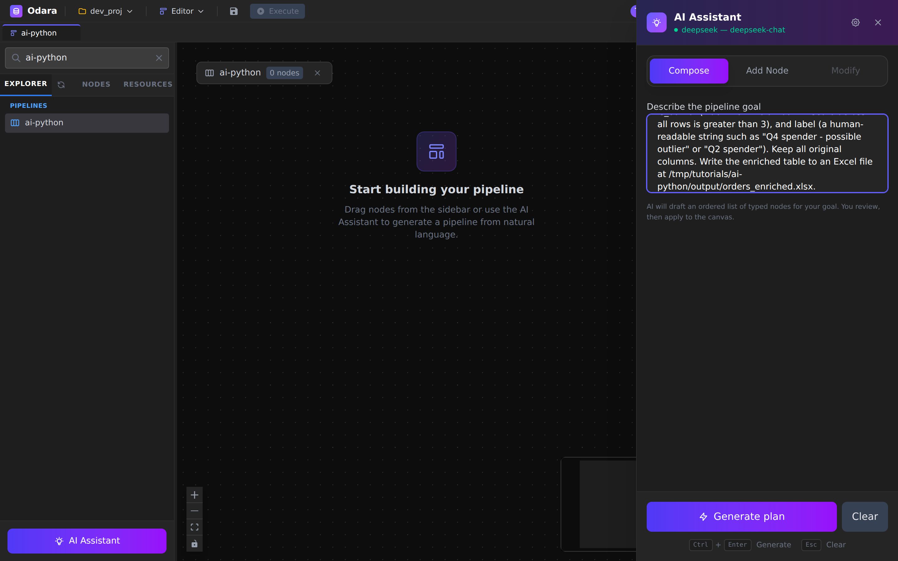
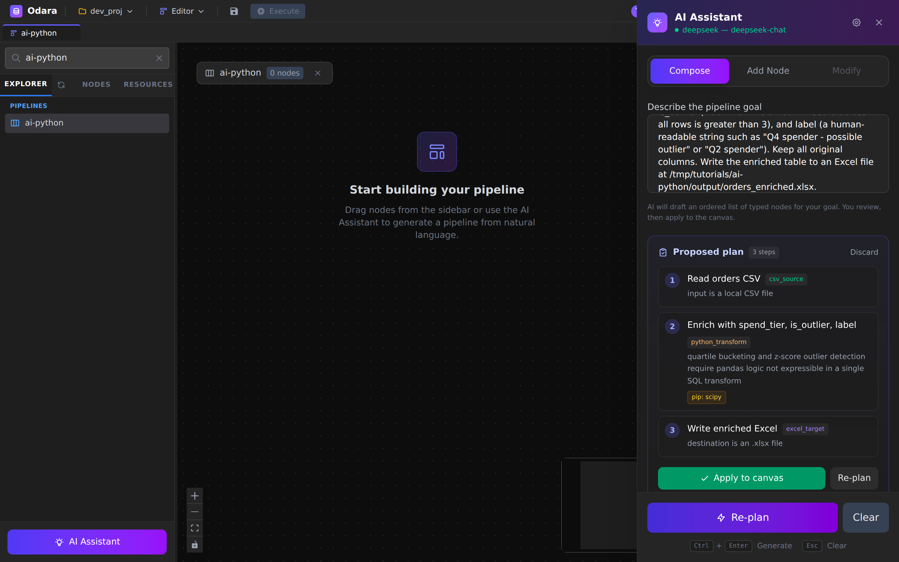
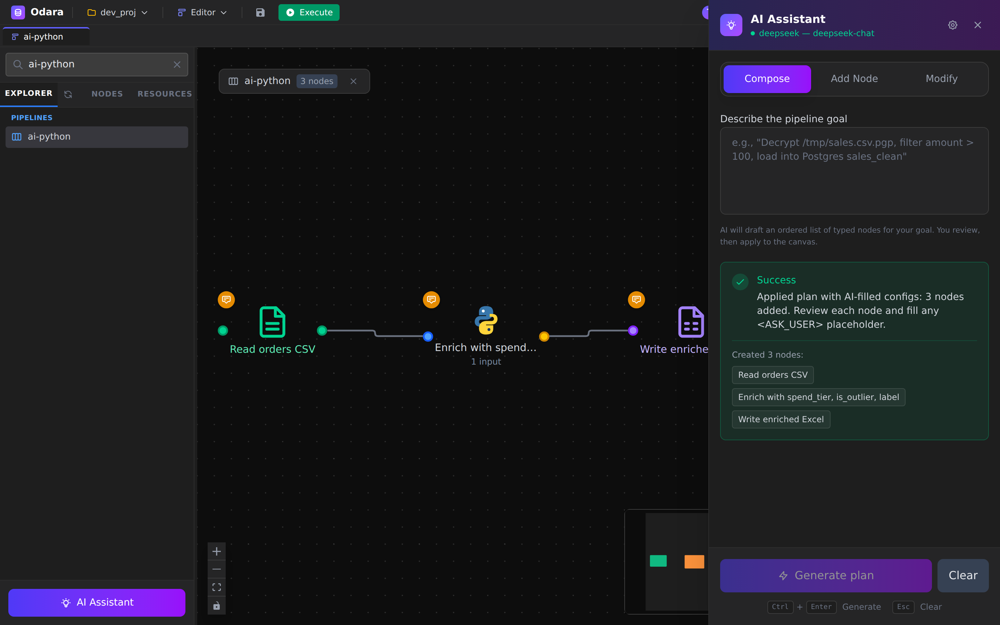
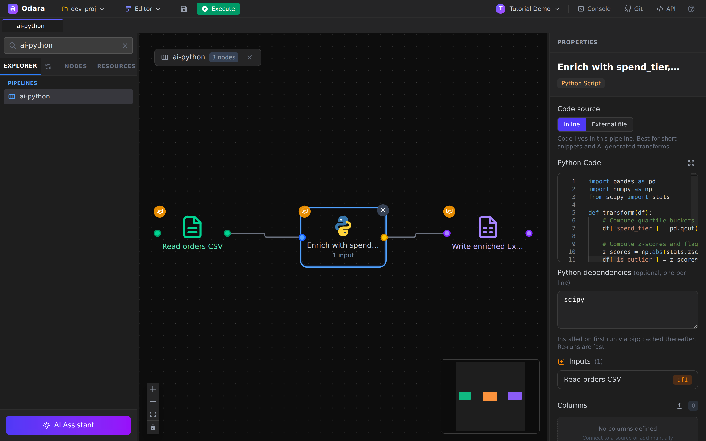
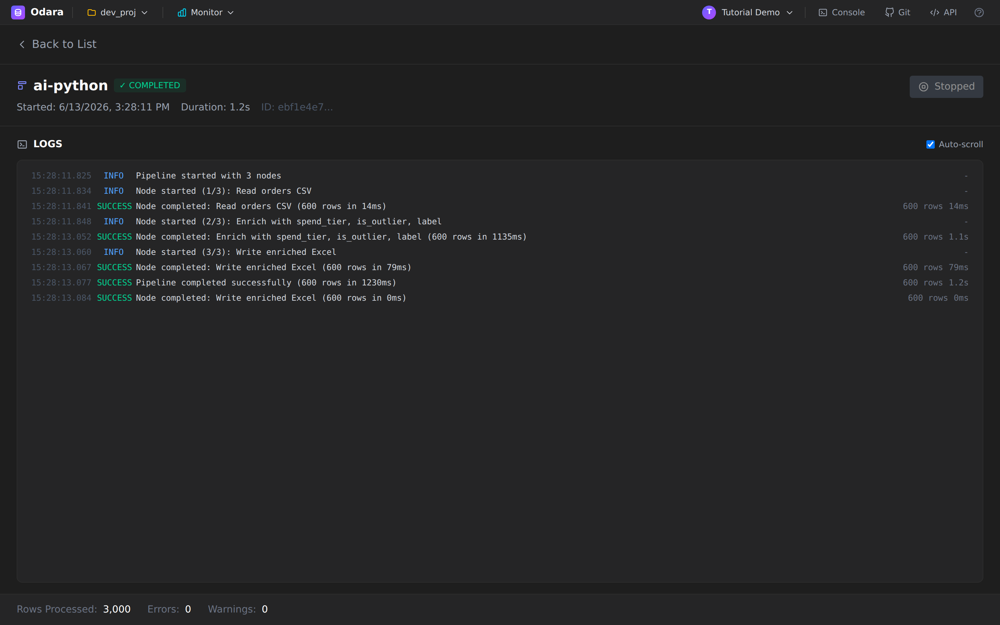

# AI Assistant → Python

> One line: describe an enrichment in plain English and the **AI
> Assistant** builds the whole pipeline — CSV in, a **pandas** transform
> (quartiles, z-score outliers, a derived label), and an Excel file out.

This is the Python companion to the [SQL walkthrough](../ai-sql/). Same
**Compose** flow, but this time the AI reaches for things SQL is clumsy
at — statistical bucketing and outlier detection — and writes them in
**Python with pandas/numpy/scipy**. Reading time **12 minutes**.

By the end you will know how to:

1. Use **Compose** to generate a Python-based pipeline from one prompt
2. Read the AI's plan and apply it to the canvas
3. Review the generated **pandas** code (and what to check before trusting it)
4. Run it and verify the enriched Excel output

## Files

Download this into a local folder (example path
`/tmp/tutorials/ai-python/`):

- **[orders.csv](./files/orders.csv)** — 600 orders (`order_id`,
  `customer`, `amount`, `order_date`) with a few deliberate high-value
  outliers so the z-score logic has something to find.

> **Prereq:** Python transforms run in Odara's Python subprocess. This
> example uses **pandas**, **numpy** and **scipy** — all present in a
> standard Odara install. If a generated transform imports a package you
> don't have, see the note in §4.

---

## 1. Describe the pipeline

Create a new pipeline, open **AI Assistant** (sidebar footer), stay in
**Compose** mode, and type the goal. (If you haven't configured a
provider yet, do step 2 of the [SQL walkthrough](../ai-sql/) first.)



```
Read orders from the CSV file at /tmp/tutorials/ai-python/orders.csv
(columns: order_id, customer, amount, order_date). Using a Python
transform with pandas, add three new columns: spend_tier (the quartile
bucket of amount labelled Q1 to Q4), is_outlier (true when the amount
z-score across all rows is greater than 3), and label (a human-readable
string such as "Q4 spender - possible outlier" or "Q2 spender"). Keep all
original columns. Write the enriched table to an Excel file at
/tmp/tutorials/ai-python/output/orders_enriched.xlsx.
```

Notice we explicitly asked for **Python** ("Using a Python transform with
pandas") — that nudges the AI to a `python_transform` instead of SQL.
Click **Generate plan**.

---

## 2. Review the plan



Three nodes:

1. **Read orders CSV** — `csv_source`
2. **Enrich with spend_tier, is_outlier, label** — `python_transform`
3. **Write enriched Excel** — `excel_target`

The AI correctly chose **one Python node** for all three derived columns
(quartiles + z-score + label are naturally one pandas pass) rather than
splitting them. Click **Apply to canvas**.

---

## 3. The pipeline appears, fully wired



Source → Python transform → Excel target, connected and configured, with
the success card listing the three created nodes.

---

## 4. Review the generated Python

Click the **Enrich…** node to see the pandas code the AI wrote:



```python
import pandas as pd
import numpy as np
from scipy import stats

def transform(df):
    # Compute quartile buckets
    df['spend_tier'] = pd.qcut(df['amount'], q=4, labels=['Q1', 'Q2', 'Q3', 'Q4'])

    # Compute z-scores and flag outliers
    z_scores = np.abs(stats.zscore(df['amount']))
    df['is_outlier'] = z_scores > 3

    # Build human-readable label
    df['label'] = df['spend_tier'].astype(str) + ' spender'
    df.loc[df['is_outlier'], 'label'] = df['spend_tier'].astype(str) + ' spender - possible outlier'

    return df
```

Three things to know about how Odara runs this:

- **No `entry_function` needed** — Odara auto-calls a function named
  `transform(df)` if you define one. The AI follows that convention.
- **DataFrame in, DataFrame out** — `df` is the upstream rows as a pandas
  DataFrame; whatever you `return` becomes the node's output.
- **Dependencies** — the AI used `scipy.stats.zscore`. scipy ships with a
  standard install, so it ran as-is. **If a generated transform imports
  something you don't have**, that's your adjustment point: either install
  it, or ask the AI (Modify mode) to rewrite without it. For a z-score,
  the numpy-only swap is one line:
  ```python
  z_scores = np.abs((df['amount'] - df['amount'].mean()) / df['amount'].std())
  ```

This is the "review and adjust" habit: the AI gets you a working transform
in seconds; you confirm the dependencies and the logic match your reality.

---

## 5. Run and verify

Hit **Execute**.



The LOGS show **600 rows** flowing through all three nodes —
`Pipeline completed successfully`. Open the Excel file and you'll find the
three new columns next to the originals:

```
order_id  customer  amount   order_date  spend_tier  is_outlier  label
2001      Carla     43.27    2026-03-02  Q1          False       Q1 spender
2010      Ana       1463.14  2026-05-09  Q4          True        Q4 spender - possible outlier
```

Across the 600 rows, the z-score rule flags **22 outliers** — the
deliberately-large orders — while quartiles split everyone into Q1–Q4 by
spend. All from one sentence.

---

## Cheat sheet

| I want to… | Do this |
|---|---|
| Generate a Python pipeline | **AI Assistant → Compose**, and say "using a Python transform with pandas". |
| Make the AI pick Python over SQL | Name the library/technique (pandas, numpy, scikit-learn) in the prompt. |
| See/edit the generated code | Click the Python Transform node → code editor. |
| Define the entry point | Just write `def transform(df): … return df` — Odara auto-calls it. |
| Drop a dependency you don't have | **Modify** mode: "rewrite without scipy", or install the package. |
| Write to Excel | An `excel_target` with a `path` ending in `.xlsx`. |

---

## What you learned

- **Compose builds Python pipelines too** — name the technique and the
  AI reaches for pandas/numpy/scipy instead of SQL.
- The generated transform follows Odara's **`transform(df)` convention**,
  so it runs with no extra wiring.
- **Review dependencies and logic** — the AI is fast and usually right,
  but you own the final check (a missing package is the most common fix).
- A statistical enrichment (quartiles + z-score outliers + labels) that
  would be tedious by hand is one prompt away.

### Next

→ **[Magic File — one node for any file format](../magic-file/)**
