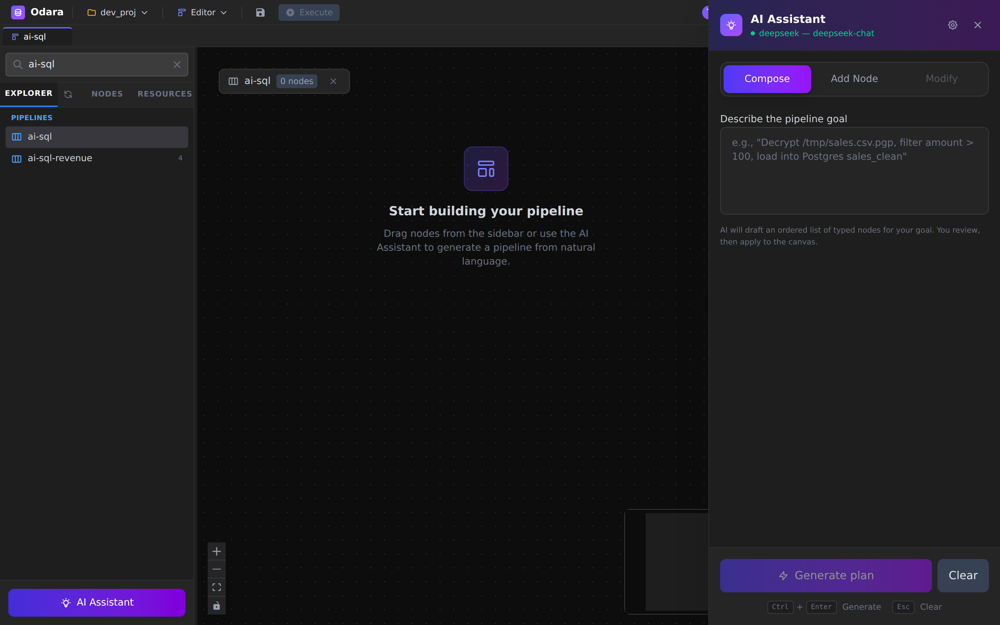
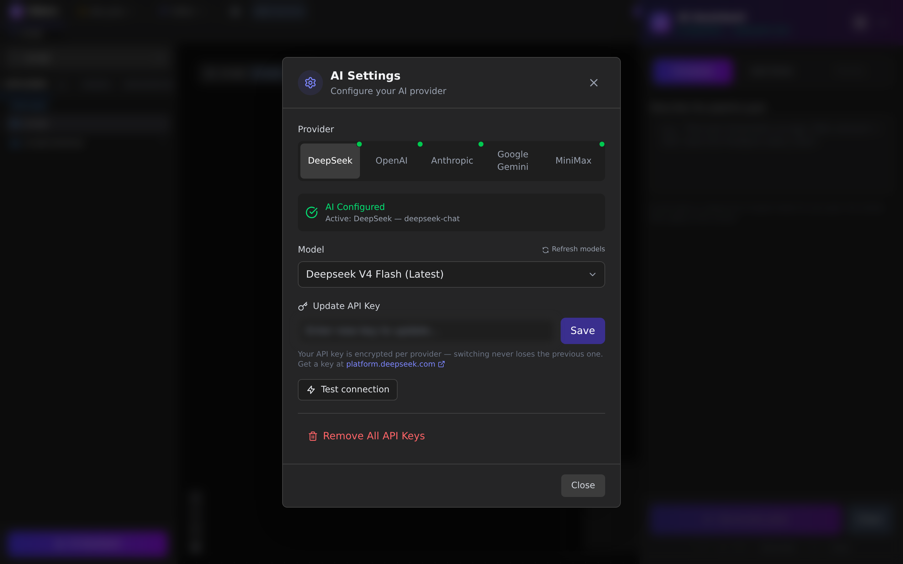
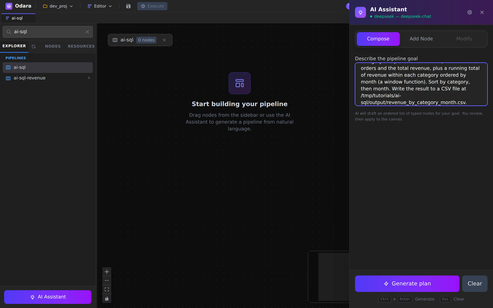
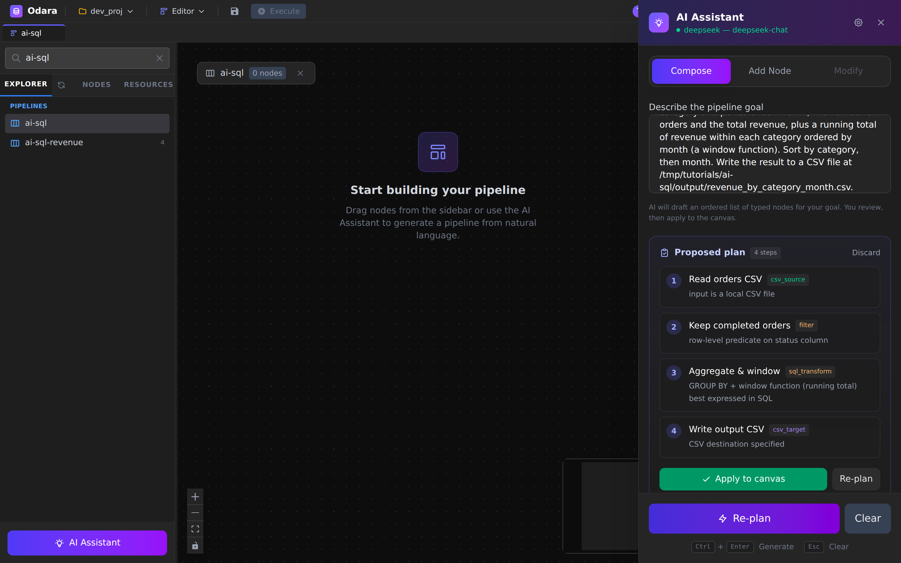
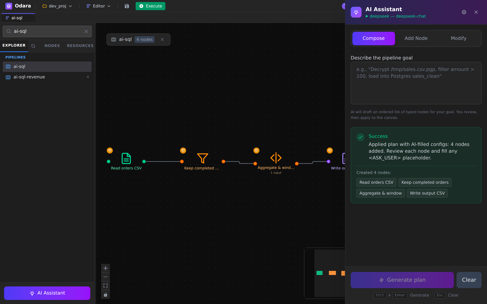
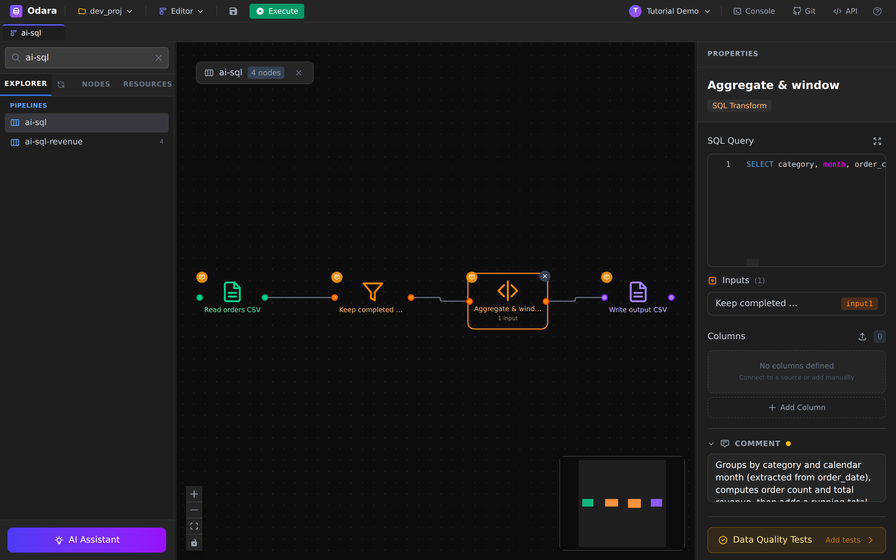
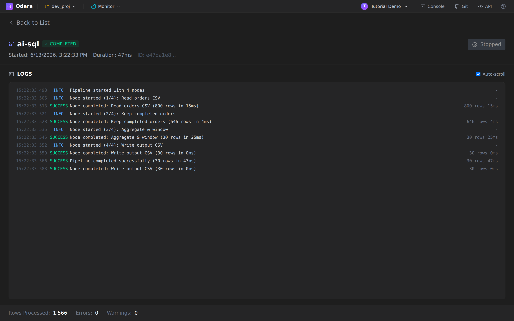

# AI Assistant → SQL

> One line: type one sentence describing what you want, and the **AI
> Assistant** plans and builds the whole pipeline — source, a SQL
> Transform with a window function, and a target — that you run as-is.

This walkthrough uses Odara's AI Assistant in **Compose** mode: you
describe a goal in plain English, the AI proposes an ordered plan, and
on approval it drops every node onto the canvas with the SQL already
written. Reading time **12 minutes**.

By the end you will know how to:

1. Configure an AI provider (DeepSeek here; any supported provider works)
2. Use **Compose** mode to generate a full pipeline from one prompt
3. Read the AI's **plan** and apply it to the canvas
4. Review and (if needed) adjust the generated SQL
5. Run it and verify the result

## Files

Download this into a local folder (the example uses
`/tmp/tutorials/ai-sql/` but any absolute path on the machine where
Odara runs works):

- **[orders.csv](./files/orders.csv)** — 800 e-commerce orders
  (`order_id`, `order_date`, `category`, `amount`, `status`).

---

## 1. Open the AI Assistant

Create a new pipeline so you have an empty canvas, then click
**AI Assistant** at the bottom of the sidebar. The panel slides in from
the right.



Three modes sit at the top:

- **Compose** — describe a goal, the AI plans the **entire** pipeline.
- **Add Node** — select existing nodes and have the AI add one transform.
- **Modify** — ask the AI to rewrite a selected node's code.

We'll use **Compose**, which is the default on an empty canvas.

---

## 2. Configure the AI provider (once)

Click the gear icon in the panel header. Pick a provider, paste its API
key, choose a model, and **Test connection**.



- Odara supports **DeepSeek, OpenAI, Anthropic, Google, MiniMax**.
- The key is **encrypted per provider** — switching providers later
  never loses a stored key.
- The green **AI Configured** badge means you're ready. The status dot
  in the panel header turns green and shows the active provider/model.

> This walkthrough uses **DeepSeek** (`deepseek-chat`) — cheap and strong
> at code. Any configured provider produces the same flow.

---

## 3. Describe the pipeline

In **Compose** mode, type your goal into the box. Be specific about the
**source**, the **transformation**, and the **target** — the AI uses
every detail.



```
Read orders from the CSV file at /tmp/tutorials/ai-sql/orders.csv
(columns: order_id, order_date, category, amount, status). Keep only
orders whose status is "completed". Then compute, per category and per
calendar month, the number of orders and the total revenue, plus a
running total of revenue within each category ordered by month (a window
function). Sort by category, then month. Write the result to a CSV file
at /tmp/tutorials/ai-sql/output/revenue_by_category_month.csv.
```

Click **Generate plan** (or `Ctrl+Enter`).

---

## 4. Review the plan

The AI returns an **ordered plan** — one typed node per step, each with
a short *why*. Nothing is on the canvas yet; this is your chance to
sanity-check the shape before committing.



For our prompt the plan is four nodes:

1. **Read orders CSV** — `csv_source`
2. **Keep completed orders** — `filter` (a row-level predicate)
3. **Aggregate & window** — `sql_transform` (GROUP BY + the running total)
4. **Write output CSV** — `csv_target`

Notice the AI split the simple `status = 'completed'` filter into its own
**Filter** node and reserved the **SQL Transform** for the real work —
the aggregation and window function. If the plan looks wrong, hit
**Re-plan**; otherwise click **Apply to canvas**.

---

## 5. The pipeline appears, fully wired

Apply expands the plan into real nodes with **filled-in configs** —
including the SQL — and connects them in order.



The green **Success** card lists what was created. Each node also gets a
sticky-note comment explaining its role.

---

## 6. Review the generated SQL

Click the **Aggregate & window** node. The SQL the AI wrote is right
there in the **SQL Query** editor:



```sql
SELECT category, month, order_count, revenue,
       SUM(revenue) OVER (PARTITION BY category ORDER BY month) AS running_total_revenue
FROM (
  SELECT category,
         DATE_TRUNC('month', order_date) AS month,
         COUNT(*) AS order_count,
         SUM(amount) AS revenue
  FROM input
  GROUP BY category, DATE_TRUNC('month', order_date)
) sub
ORDER BY category, month
```

That's a correct, non-trivial query: a grouped aggregate wrapped in a
**window function** for the per-category running total.

> **Always review what the AI writes.** In our run it ran as-is — the CSV
> reader inferred `order_date` as a date and `amount` as a number, so no
> casts were needed. Two things to check on your own data:
> - **Input name** — Odara exposes a single upstream as both `input` and
>   `input1`. If the AI references a name your engine doesn't recognise,
>   rename it here.
> - **Types** — if a column comes in as text, wrap it
>   (`CAST(amount AS DOUBLE)`, `CAST(order_date AS DATE)`) before
>   aggregating. This is the "review and adjust" step — the AI gets you
>   95% there, you own the last 5%.

---

## 7. Run and verify

Hit **Execute**. The run finishes in tens of milliseconds.



Reading the LOGS top-to-bottom:

- `Read orders CSV` — **800 rows**
- `Keep completed orders` — **646 rows** (the cancelled/returned dropped)
- `Aggregate & window` — **30 rows** (5 categories × 6 months)
- `Write output CSV` — **30 rows**

On disk:

```bash
$ head -4 /tmp/tutorials/ai-sql/output/revenue_by_category_month.csv
category,month,order_count,revenue,running_total_revenue
Books,2026-01-01T00:00:00,22,820.34,820.34
Books,2026-02-01T00:00:00,15,522.53,1342.87
Books,2026-03-01T00:00:00,22,639.74,1982.61
```

The `running_total_revenue` column climbs within each category — exactly
what the window function was asked to do.

---

## Cheat sheet

| I want to… | Do this |
|---|---|
| Build a whole pipeline from a sentence | **AI Assistant → Compose**, describe source + transform + target. |
| Sanity-check before committing | Read the **plan**; click **Re-plan** if it's wrong. |
| Drop the generated nodes on the canvas | **Apply to canvas**. |
| See/edit the AI's SQL | Click the SQL Transform node → **SQL Query**. |
| Reference the upstream table in SQL | `input` or `input1`. |
| Fix a string column before math | `CAST(col AS DOUBLE)` / `CAST(col AS DATE)`. |
| Switch AI provider without re-entering keys | Settings → pick another provider tab (keys are stored per provider). |

---

## What you learned

- **Compose mode turns one sentence into a full pipeline** — source,
  filter, SQL Transform, and target, wired and configured.
- The AI **plans first** (typed steps + why), so you approve the shape
  before any node lands on the canvas.
- It writes **real SQL**, including window functions, and infers output
  columns — but you should always **review and adjust** types and the
  input table name.
- The generated pipeline is a normal Odara pipeline: run it, monitor it,
  edit it like any other.

### Next

→ **[AI Assistant (Python) — generate a pandas transform](../ai-python/)**
