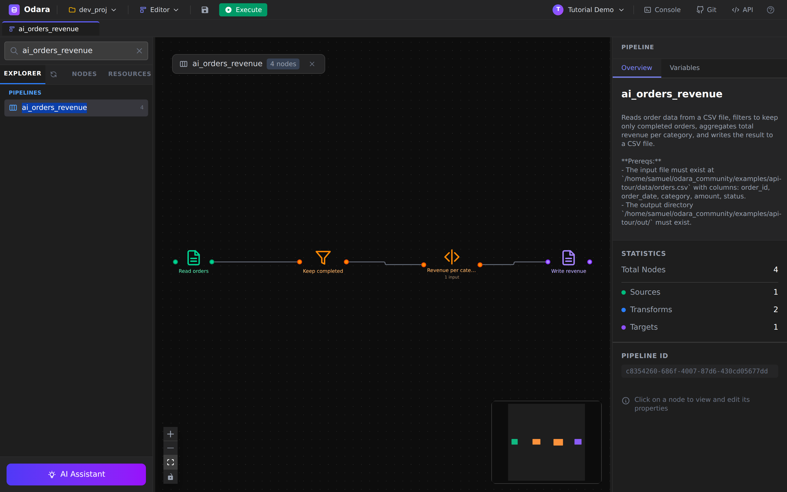

# The API

> One line: everything you do in the Odara UI, you can do over a REST API —
> including letting the AI **build and run a whole pipeline from one sentence**,
> headless. The visual editor is the cockpit; the API is the engine.

Most ETL tools treat their API as an afterthought. Odara's is first-class: the
same pipelines you draw on the canvas are plain JSON you can create, run,
stream, and orchestrate over HTTP. That means **ETL as code** (versioned in
Git), pipelines **an LLM or agent generates on the fly**, and headless runs you
can wire into your own scheduler or product.

This walkthrough uses `curl` (the calls are identical from Python, Node, or any
stack). Every command and every output below is real. Reading time **12 minutes**.

By the end you will know how to:

1. Authenticate and understand the **pipeline-as-JSON** shape
2. **Create and run** a pipeline (ETL as code)
3. Let the **AI plan and compose** a whole pipeline from a goal
4. **Run headless and stream** live progress (SSE)
5. **Discover** a file's schema before you build
6. **Orchestrate** multiple pipelines with Maestro

> All the scripts in this guide live in the repo at `examples/api-tour/`.

---

## 0. The three things you need

**Base URL.** The API is at `http://localhost:3002`.

**Auth.** POST your credentials to `/api/v1/auth/login` and reuse the bearer token:

```bash
BASE=http://localhost:3002
TOKEN=$(curl -s -X POST $BASE/api/v1/auth/login \
  -H 'Content-Type: application/json' \
  -d '{"email":"you@odara.local","password":"••••"}' \
  | python3 -c "import sys,json;print(json.load(sys.stdin)['access_token'])")
```

**A pipeline is just JSON** — a `name`, a list of `nodes`, and the `edges`
between them. Node config is *flat* with a `type` discriminator
(`csv_source`, `sql_transform`, `csv_target`, `postgres_source`, …):

```jsonc
{
  "name": "orders_revenue_by_category",
  "nodes": [
    { "id": "…", "name": "orders_csv", "node_type": "source",
      "config": { "type": "csv_source", "path": "/…/orders.csv", "has_header": true } },
    { "id": "…", "name": "revenue_by_category", "node_type": "transform",
      "config": { "type": "sql_transform",
        "query": "SELECT category, COUNT(*) AS order_count, ROUND(SUM(amount),2) AS revenue FROM input WHERE status='completed' GROUP BY category ORDER BY revenue DESC" } },
    { "id": "…", "name": "revenue_csv", "node_type": "target",
      "config": { "type": "csv_target", "path": "/…/out/revenue_by_category.csv", "has_header": true } }
  ],
  "edges": [
    { "kind": "data", "id": "…", "source": "<orders_csv id>", "target": "<transform id>" },
    { "kind": "data", "id": "…", "source": "<transform id>", "target": "<revenue_csv id>" }
  ]
}
```

---

## 1. Create and run a pipeline (ETL as code)

POST that JSON to `/api/v1/pipelines`, then run it:

```bash
# Create
PID=$(curl -s -X POST $BASE/api/v1/pipelines \
  -H "Authorization: Bearer $TOKEN" -H 'Content-Type: application/json' \
  -d @pipeline.json | python3 -c "import sys,json;print(json.load(sys.stdin)['id'])")

# Run
curl -s -X POST $BASE/api/v1/pipelines/$PID/run -H "Authorization: Bearer $TOKEN"
```

The moment you create it, the pipeline is **on the canvas in the UI, fully
configured** — the API and the editor are the same system. Here's the pipeline
we'll build with the AI in the next step, opened in the editor:



The run returns a per-node result. 800 orders in, filtered to completed,
summed per category, written out — in tens of milliseconds:

```
category     order_count  revenue
Electronics  132          31295.41
Sports       129          14515.76
Home         138          9965.76
Toys         121          6329.80
Books        126          4090.73
```

**Use case:** your pipelines live in Git. Code review for data flows. The exact
same definition deployed from dev to prod — reproducible every time.

---

## 2. Let the AI build it — from one sentence

Describe a *goal* and POST it to `/api/v1/ai/plan`. The AI returns an ordered,
typed plan, each step with a reason:

```bash
curl -s -X POST $BASE/api/v1/ai/plan \
  -H "Authorization: Bearer $TOKEN" -H 'Content-Type: application/json' \
  -d '{"goal":"Read orders.csv (order_id, order_date, category, amount, status), keep only completed orders, total revenue per category, write a CSV."}'
```
```
csv_source       Read orders            - local CSV on disk
filter           Keep completed         - single row-level predicate on status
sql_transform    Revenue per category   - simple GROUP BY SUM in SQL
csv_target       Write revenue CSV      - CSV destination
```

Notice it split the simple `status='completed'` predicate into its own **Filter**
node and reserved **SQL** for the real aggregation. Nothing is on the canvas
yet — this is a proposal you approve.

Then `/api/v1/ai/compose` expands the approved plan into real nodes and edges.
The full **goal → plan → compose → create → run** is one script
(`scripts/ai_compose_run.py`):

```
1) PLAN     csv_source → filter → sql_transform → csv_target
2) COMPOSE  4 nodes, 3 edges
3) CREATE   pipeline id: c8354260-…
4) RUN
   ▸ Read orders            800 rows
   ▸ Revenue per category     5 rows
   success: True in 54 ms
```

A sentence became a working, running pipeline — the same one pictured above.

**Use case:** this is how an agent, or your own product, builds ETL on the fly.
Odara is the engine behind the prompt.

> You can also generate just the SQL or Python for a single transform with
> `POST /api/v1/ai/generate` (`{"mode":"create","language":"sql","prompt":"…"}`).

---

## 3. Run headless — and watch (SSE)

Running headless doesn't mean running blind. `GET /run-stream` is a
**Server-Sent Events** endpoint — one event per node, live:

```bash
curl -sN $BASE/api/v1/pipelines/$PID/run-stream \
  -H "Authorization: Bearer $TOKEN" -H 'Accept: text/event-stream'
```
```
> orders_revenue  (4 nodes)
    ok orders_csv             800 rows  16ms
    ok revenue_by_category      5 rows  16ms
    ... settle
    ok settle                   5 rows  3001ms
  done: 5 rows, 3058ms
```

You get `pipeline_started`, `node_started`, `node_completed` (with row counts and
durations), and `pipeline_completed`. This is what you wire into a scheduler,
a cron job, or your own progress dashboard. Need to stop a run? `POST
/api/v1/pipelines/:id/abort`.

---

## 4. Discover a file's schema before you build

How do you build a pipeline for data you've never seen? Ask. `POST
/api/v1/files/infer-schema` reads a file and returns typed columns with samples:

```bash
curl -s -X POST $BASE/api/v1/files/infer-schema \
  -H "Authorization: Bearer $TOKEN" -H 'Content-Type: application/json' \
  -d '{"path":"/…/orders.csv","file_type":"csv"}'
```
```
order_id     integer  e.g. 1001
order_date   date     e.g. 2026-03-18
amount       float    e.g. 66.64
status       string   e.g. completed
```

For databases it's the same idea: `POST /api/v1/metadata/test-connection` to
check reachability, and `/api/v1/metadata/introspect-schema` to list tables and
columns. Feed the result straight into the pipeline you generate.

---

## 5. Orchestrate with Maestro

One pipeline is rarely the whole job. **Maestro** is Odara's orchestrator, and
it's API-driven too. Create a maestro that wraps pipelines in a *parallel group*
and run it:

```bash
# steps: a parallel_group containing pipeline_call steps
MID=$(curl -s -X POST $BASE/api/v1/maestros \
  -H "Authorization: Bearer $TOKEN" -H 'Content-Type: application/json' \
  -d @maestro.json | python3 -c "import sys,json;print(json.load(sys.stdin)['id'])")

curl -s -X POST $BASE/api/v1/maestros/$MID/run -H "Authorization: Bearer $TOKEN"
# -> { "success": true, "total_pipelines": 2, "completed_pipelines": 2, … }
```

Series, parallel, conditional branches, retries — your whole multi-stage
workflow, defined and triggered over HTTP. This is your nightly load, as code.

---

## The same calls, from your stack

It's plain HTTP, so any language works. Node, with `fetch`:

```js
const res = await fetch(`${BASE}/api/v1/pipelines/${id}/run`, {
  method: "POST",
  headers: { Authorization: `Bearer ${token}` },
});
const result = await res.json();   // { success, node_results, total_duration_ms }
```

TypeScript is identical — just add types. Python is in the repo
(`scripts/ai_compose_run.py`).

---

## Cheat sheet

| I want to… | Call |
|---|---|
| Get a token | `POST /api/v1/auth/login` → `access_token` |
| Create a pipeline | `POST /api/v1/pipelines` (body: `{name, nodes, edges}`) |
| Run it | `POST /api/v1/pipelines/:id/run` |
| Watch it live | `GET /api/v1/pipelines/:id/run-stream` (SSE) |
| Stop a run | `POST /api/v1/pipelines/:id/abort` |
| Preview one node | `POST /api/v1/preview` |
| Plan from a goal | `POST /api/v1/ai/plan` |
| Compose the pipeline | `POST /api/v1/ai/compose` |
| Generate SQL/Python | `POST /api/v1/ai/generate` |
| Infer a file's schema | `POST /api/v1/files/infer-schema` |
| Test a DB connection | `POST /api/v1/metadata/test-connection` |
| Introspect DB tables | `POST /api/v1/metadata/introspect-schema` |
| Orchestrate pipelines | `POST /api/v1/maestros` + `/maestros/:id/run` |

---

## What you learned

- A pipeline is **JSON** — create it, version it, deploy it identically across
  environments.
- The AI **plans and composes** a full pipeline from a sentence, over the API —
  the same engine your own app or agent can call.
- Runs are **headless and observable**: stream per-node progress with SSE, abort
  on demand.
- **Schema discovery** and **Maestro orchestration** are API-first too.
- Whatever you build by API is a normal Odara pipeline — it shows up on the
  canvas, runs, and monitors like any other.

### Next

→ **[AI Assistant (SQL) — describe a pipeline in the UI](../ai-sql/)**
