# Documentation

> One line: Odara reads your whole project — every pipeline, maestro, and
> connection — and turns it into living documentation you can browse,
> export to PDF, or publish as a shareable website. You write nothing by
> hand.

Most ETL tools leave documentation as homework: someone, eventually,
screenshots a few flows into a wiki that's stale by the next sprint.
Odara takes the opposite stance — the **Documentation** workspace is
generated **from the pipelines themselves**, so it is always current. It
renders the diagrams, lists every node's configuration, redacts secrets,
and gives you two ways to share: a **PDF** for an email or a ticket, and
a **published webpage** for a link.

This walkthrough uses a small retail-analytics project — **6 pipelines**,
**1 maestro**, and **3 connections** — so every screen has real content.
Reading time **14 minutes**.

By the end you will know how to:

1. Open the Documentation workspace and read the **Project Overview**
2. Navigate pipelines, maestros, and resources from the **sidebar**
3. Read a pipeline's **diagram, metadata, and node-by-node config**
4. Add **descriptions** that become part of the docs
5. Understand a **maestro's execution flow** and referenced pipelines
6. See how **connection credentials are redacted**
7. **Export to PDF** — one item or the whole project
8. **Publish** a shareable, access-controlled documentation site

---

## 1. Open the Documentation workspace

Documentation is one of the top-level pages. Click the **page menu** in
the toolbar (next to the project name) and choose **Documentation**.

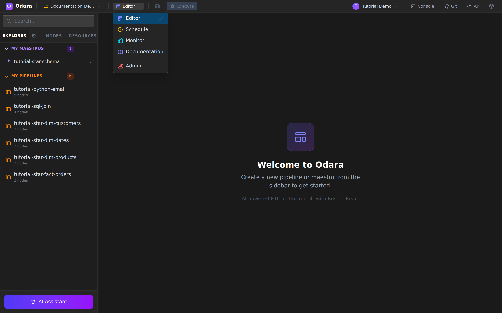

There is nothing to set up. The moment it opens, Odara has already
scanned the current project and counted everything — the header reads
**“10 items documented”** for our demo (6 pipelines + 1 maestro + 3
resources). The **Refresh** button re-scans on demand, and the page also
re-scans automatically whenever you switch back to the tab, so it tracks
your edits in the Editor.

> Documentation is **per project**. Switch projects from the selector to
> the left of the page menu and the docs follow.

---

## 2. The Project Overview

Click **Project Overview** at the top of the sidebar for the bird's-eye
view of the entire project.

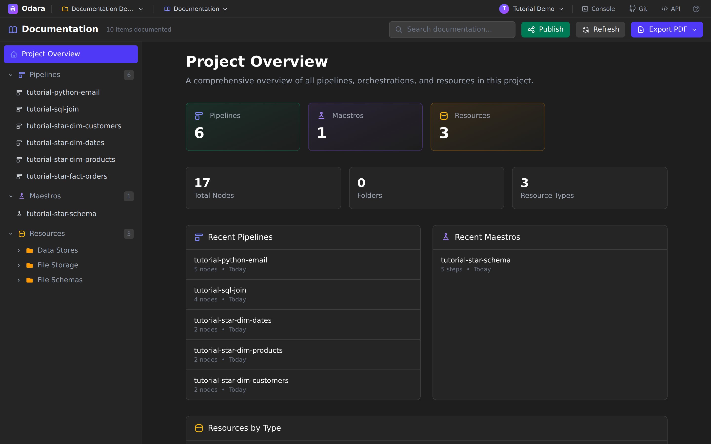

At a glance you get:

- **Counts** — pipelines, maestros, and resources as big stat cards.
- **Totals** — **Total Nodes** across every pipeline (17 here),
  **Folders**, and the number of distinct **Resource Types**.
- **Recent Pipelines / Recent Maestros** — the five most recently edited,
  each clickable straight through to its own page.

Scroll down and the overview groups your connections under
**Resources by Type**, so you can see at a glance that the project talks
to, say, one PostgreSQL warehouse, one S3 bucket, and one CSV schema.

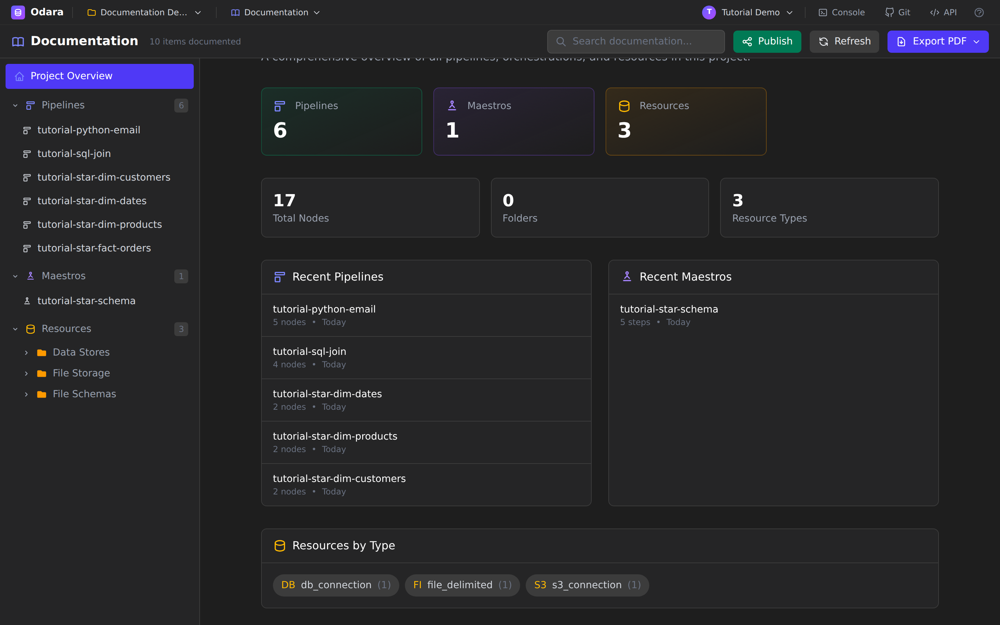

---

## 3. Navigate from the sidebar

The left sidebar is the table of contents. It has three collapsible
sections — **Pipelines**, **Maestros**, and **Resources** — each with a
count badge.

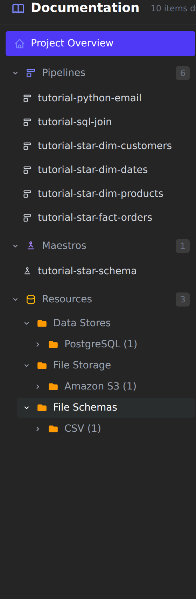

Pipelines and maestros are listed by name (folders are preserved if you
use them). **Resources** are organised two levels deep — first by
**domain** (Data Stores, File Storage, File Schemas, Streaming, …), then
by **type** (PostgreSQL, Amazon S3, CSV, …) — so a project with dozens of
connections stays tidy. Click any leaf to open its page.

---

## 4. A pipeline's documentation

Click a pipeline — here **`tutorial-sql-join`** — to open its page.

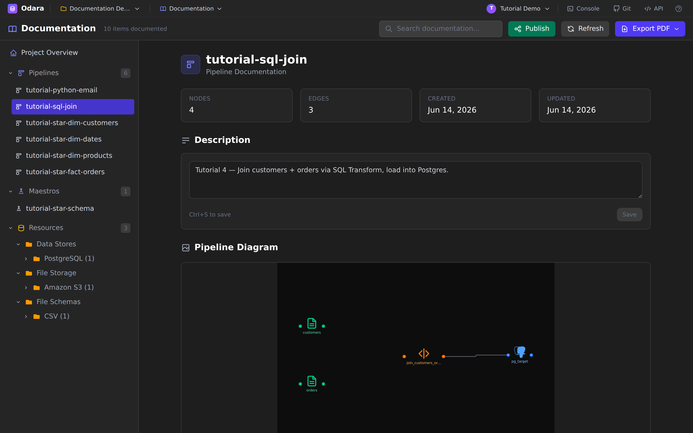

The top of the page is a quick fact sheet:

- **Metadata cards** — **Nodes**, **Edges**, **Created**, **Updated**.
- **Description** — an editable summary (see step 6).
- **Pipeline Diagram** — the exact graph from the Editor, **rendered
  automatically**. If a pipeline has never been captured, Odara renders
  it off-screen the first time you open its page and saves the image;
  hover the diagram to **regenerate** it after you change the flow, or
  click to view it full-screen.

> The diagram is the same React Flow graph you build in the Editor, so
> what you document is exactly what runs — no hand-drawn boxes that drift
> out of date.

---

## 5. Node-by-node detail

Keep scrolling and the page breaks the pipeline down by role:
**Source Nodes**, **Transform Nodes**, **Target Nodes**, and **Control
Nodes**, each with its own count. A **Data Quality Tests** panel sits
above them, summarising any tests attached to the pipeline.

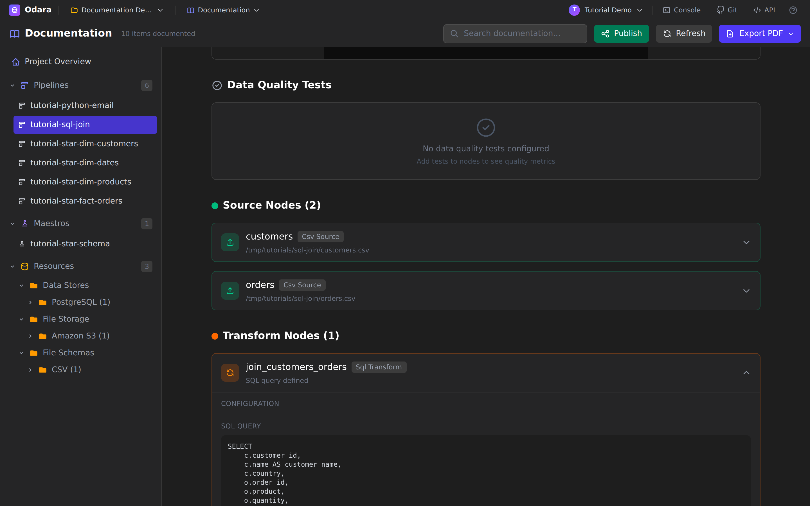

Click any node card to expand it. For our join pipeline the two CSV
sources show their file paths, and the **`join_customers_orders`** SQL
Transform expands to reveal the actual **SQL query** that runs — the same
code that's in the node. Python transforms show their script, database
nodes show their table and connection, and so on. This is the level of
detail a reviewer or a new teammate needs to understand *what the
pipeline really does*, without opening the Editor.

---

## 6. Write descriptions that stick

The **Description** box on every pipeline and maestro is editable right
here in the docs. Type a summary and click **Save** (or press
**Ctrl/Cmd+S**).

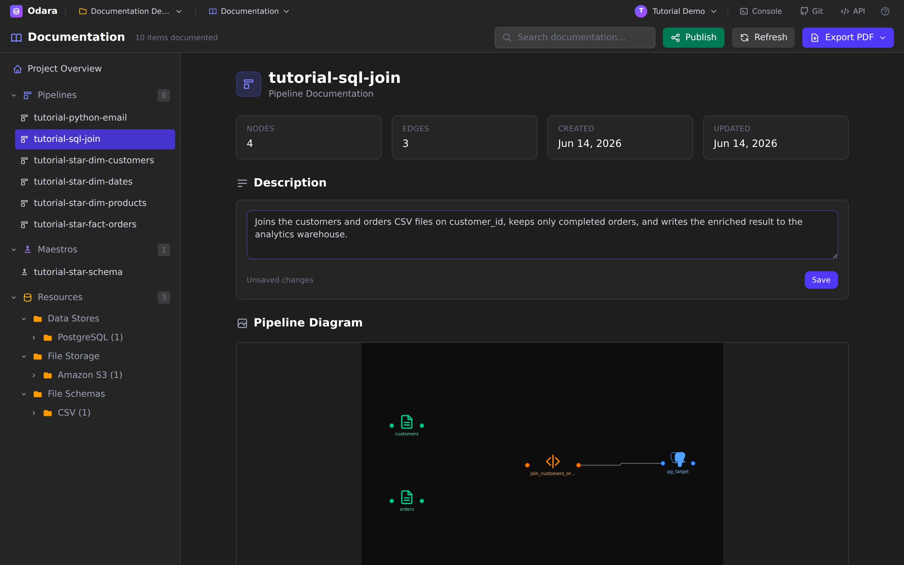

A small status line tracks state — **Unsaved changes** while you type,
then **Saved**. The description is stored on the pipeline itself, so it
shows up everywhere: the Project Overview, the exported PDF, and the
published site. Write it once, and it travels with the project.

> A good description answers the three questions a diagram can't: *where
> does the data come from, what business rule is applied, and where does
> it land?*

---

## 7. Maestro documentation — the execution flow

Maestros (orchestrations) get the same treatment, plus a view of *how the
pipelines run together*. Open **`tutorial-star-schema`**.

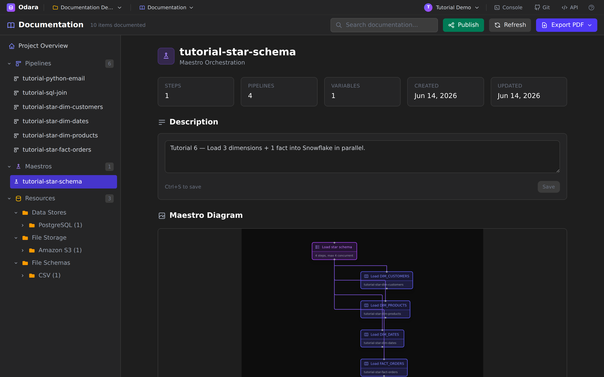

The metadata cards now count **Steps**, **Pipelines**, and **Variables**,
and the diagram shows the orchestration shape. Scroll down for the
**Execution Flow** — the steps in order, each tagged with its type
(*parallel group*, *pipeline call*, *conditional*) — followed by the
maestro's **Variables** and a list of every **Referenced Pipeline**.

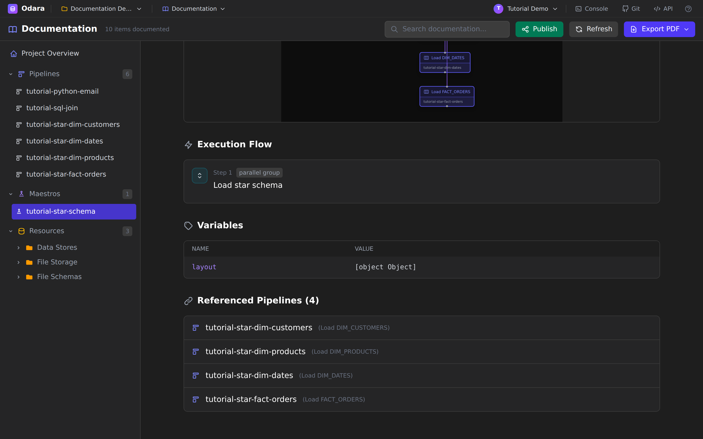

Here you can read, without guessing, that the maestro loads three
dimensions and a fact table **in parallel** under a single “Load star
schema” group, and exactly which pipeline each step calls.

---

## 8. Resource documentation — with secrets redacted

Open a connection — **Analytics Warehouse**, under Data Stores →
PostgreSQL.

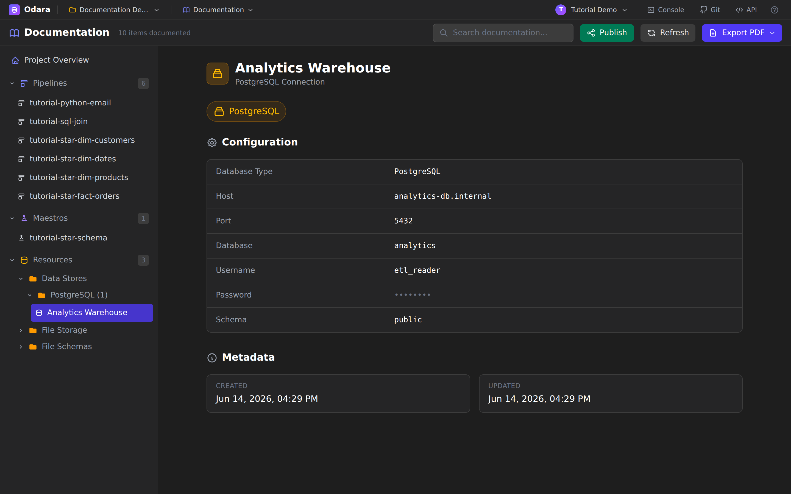

Each resource page renders a **Configuration** table appropriate to its
type — host, port, database, username, schema for a database; region and
bucket for S3; and so on — plus created/updated metadata. Note the
**password is masked**. Credentials are **never** written into the
documentation, the PDF, or a published page, so docs are safe to share
outside your team.

---

## 9. Find anything fast

The **Search documentation…** box in the header filters the whole sidebar
by name and description as you type — pipelines, maestros, and resources
at once.

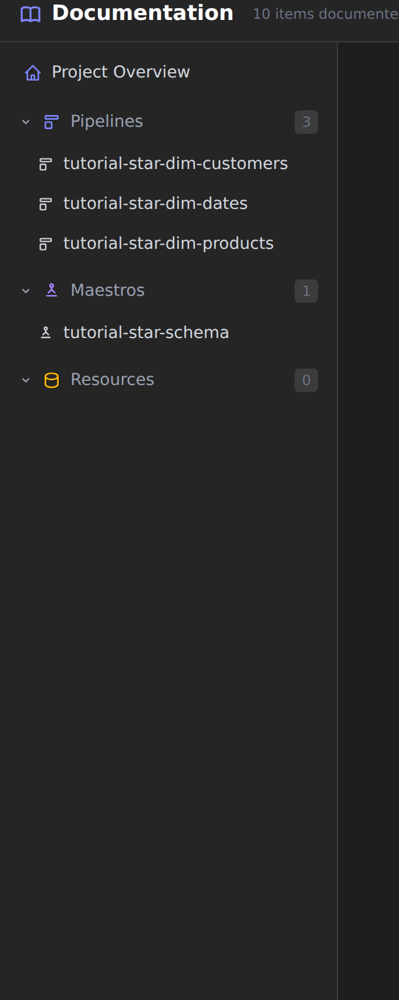

Typing `dim`, for example, narrows the tree to just the dimension
pipelines. Clear the box to bring everything back.

---

## 10. Export to PDF

Click **Export PDF** for a dropdown with two choices.

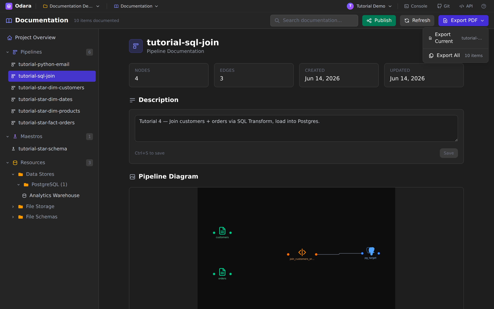

- **Export Current** — the item selected in the sidebar (a single
  pipeline, maestro, or resource). The filename reflects it, e.g.
  `odara-pipeline-tutorial-sql-join.pdf`.
- **Export All** — the entire project as one `odara-documentation.pdf`.
  Before it builds, Odara **captures any missing diagrams** off-screen so
  nothing is blank, showing a *“Generating screenshots N / M”* progress
  bar on large projects.

The PDF is generated server-side (Markdown → Typst → PDF), so the layout
is clean and print-ready — diagrams, tables, node configs and all. When
it's done, a toast confirms the file and the conventional download
location for your OS:

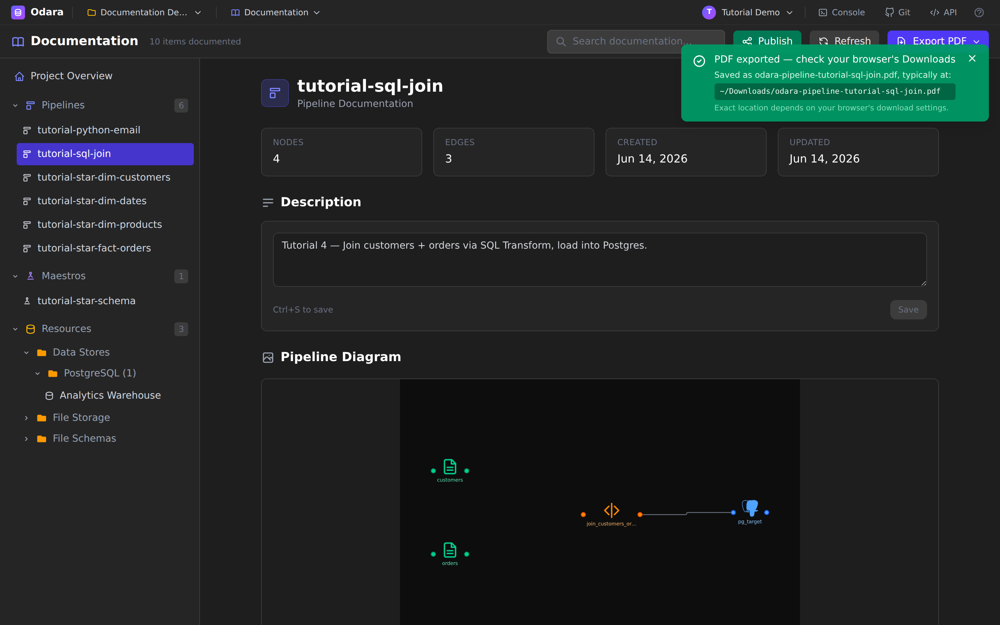

> The browser doesn't hand the real save path to a web page, so the
> location is a best-effort hint (`~/Downloads` on Linux/macOS,
> `%USERPROFILE%\Downloads` on Windows). If you've pointed your browser
> somewhere else, that's where it landed.

---

## 11. Publish a shareable site

A PDF is great for an attachment; a **link** is better for a living
reference. Click **Publish** to open the publication dialog.

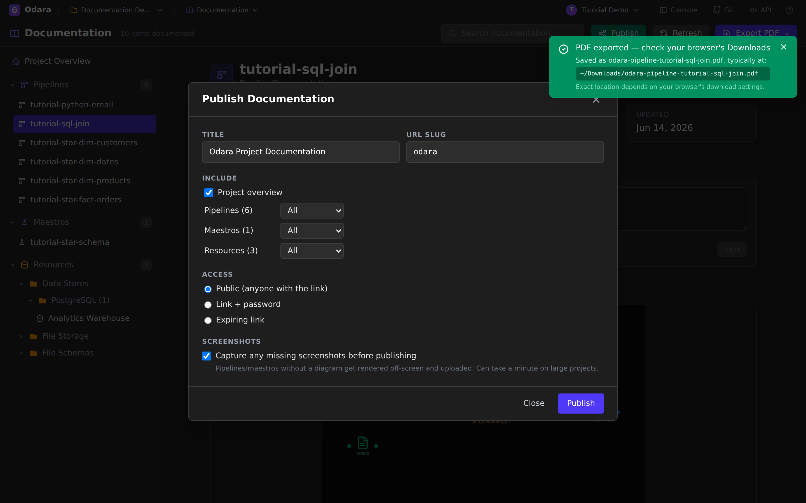

You control exactly what goes out:

- **Title** and **URL slug** — the slug forms the public address
  (lowercase letters, digits, and hyphens).
- **Include** — toggle the **Project overview**, and set Pipelines,
  Maestros, and Resources each to **All**, **Selected…**, or **None**.
  Publish only the pipelines a client should see, for instance.
- **Access** — choose how the link is protected:

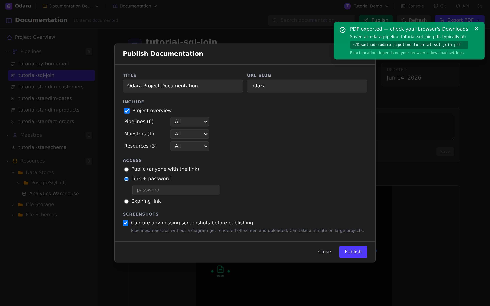

  - **Public** — anyone with the link.
  - **Link + password** — a password gate (field appears when selected).
  - **Expiring link** — auto-expires after **7 / 30 / 90 days** (or
    never).

- **Screenshots** — *Capture any missing screenshots before publishing*
  renders absent diagrams off-screen so the published page is complete.

Click **Publish**. Odara returns a **Published!** banner with the live
URL, and the publication now appears under **Existing Publications** with
**Copy**, **Bump** (publish a new version while keeping the `/latest`
link stable), and **Revoke** (take it offline) controls.

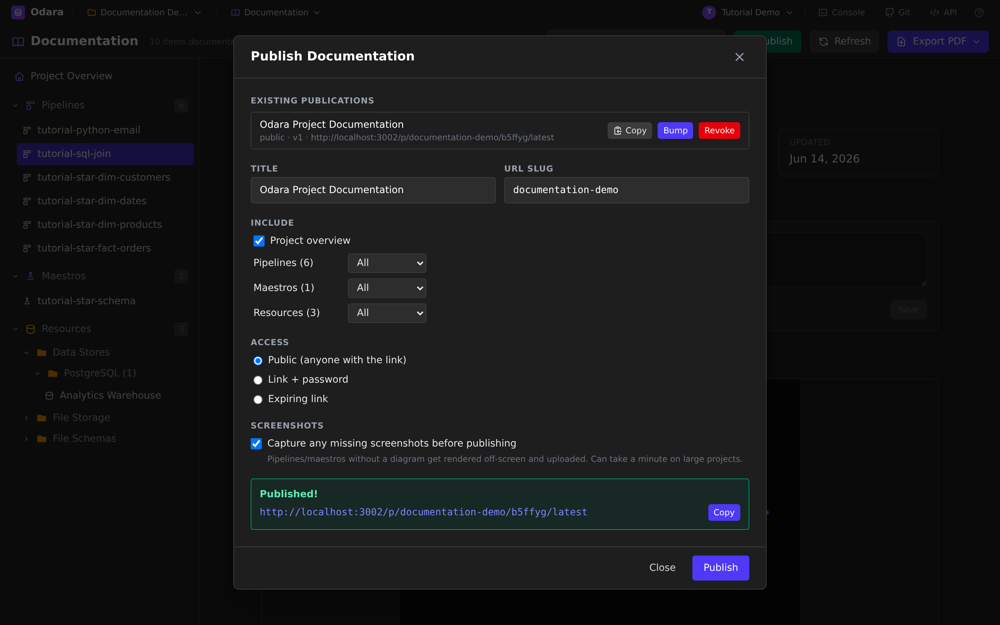

---

## 12. What your readers see

Open the published link — no login required (subject to the access mode
you picked) — and your readers get a clean, read-only documentation site:
the same sidebar navigation, the project overview, and every pipeline,
maestro, and resource you chose to include.

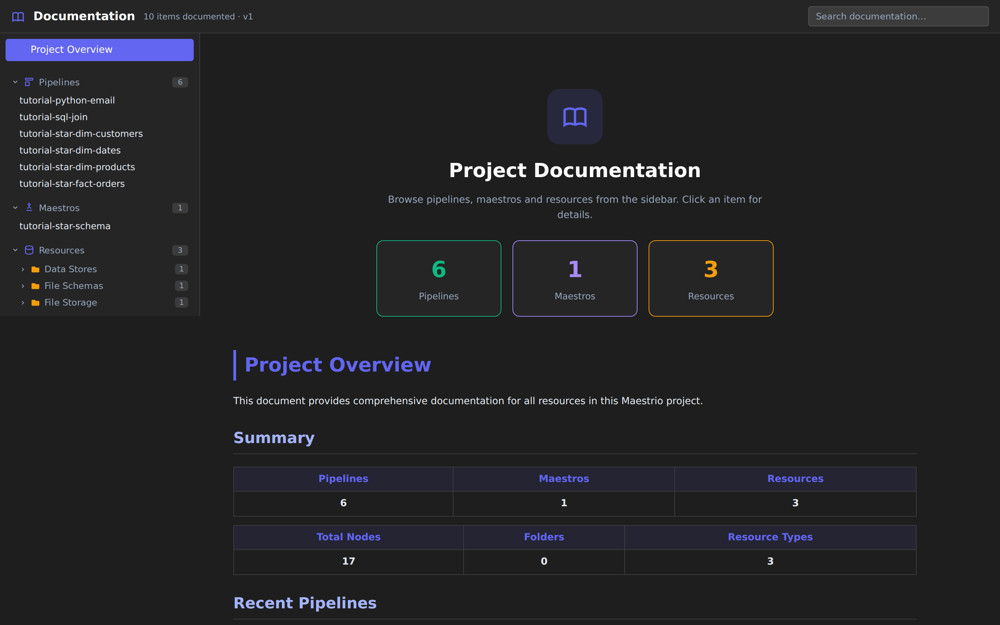

Credentials stay redacted, the version is stamped in the header, and
because you can **Bump** without changing the URL, the link you shared
last quarter keeps pointing at the latest docs.

---

## Cheat sheet

| I want to… | Do this |
|---|---|
| Open the docs | Page menu → **Documentation** |
| Re-scan after editing | **Refresh** (or just switch back to the tab) |
| See the whole project at a glance | **Project Overview** in the sidebar |
| Read one pipeline's diagram + node configs | Click the pipeline; expand any node card |
| Document the *why* | Edit the **Description** box → **Ctrl/Cmd+S** |
| See how a maestro runs | Open it → **Execution Flow** |
| Find an item fast | **Search documentation…** in the header |
| Hand someone a single doc | **Export PDF → Export Current** |
| Hand someone the whole project | **Export PDF → Export All** |
| Share a live link | **Publish** → set scope + access → copy the URL |
| Update a shared link in place | Publish modal → **Bump** |
| Take a link offline | Publish modal → **Revoke** |

---

## What you learned

- The **Documentation** workspace is generated **from your project** —
  diagrams, node configs, and resource settings are always current, never
  hand-maintained.
- The **Project Overview** is the map; the **sidebar** drills into every
  pipeline, maestro, and connection.
- **Descriptions** you write in the docs travel everywhere — overview,
  PDF, and published site.
- **Connection credentials are always redacted**, so docs are safe to
  share.
- **Export PDF** gives you a print-ready file for one item or the whole
  project; **Publish** gives you an access-controlled, versioned link.

### Next

→ **[AI Assistant (SQL) — describe a pipeline, get a working transform](../ai-sql/)**
