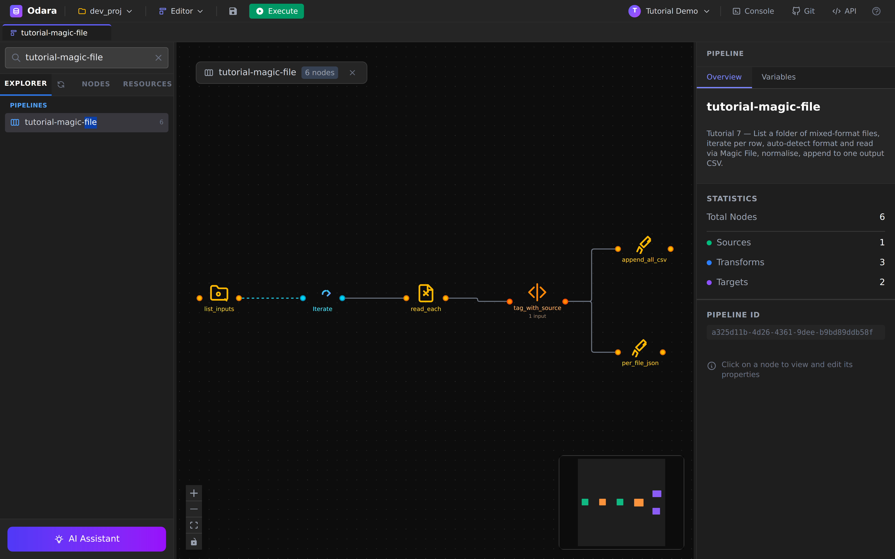
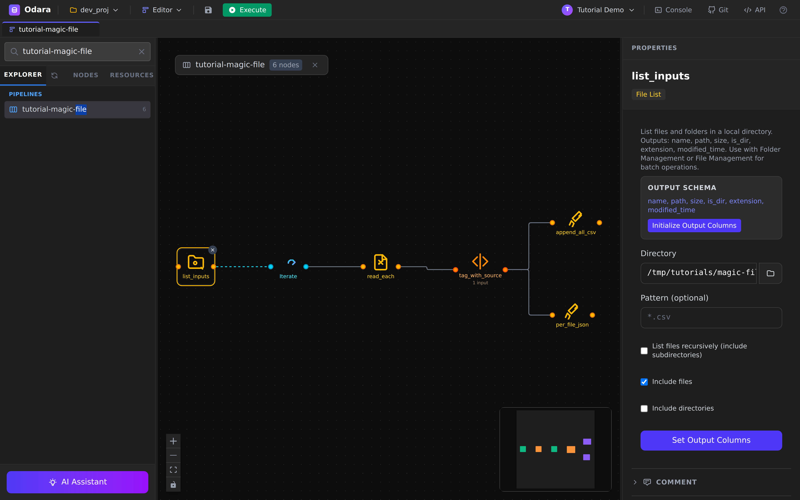
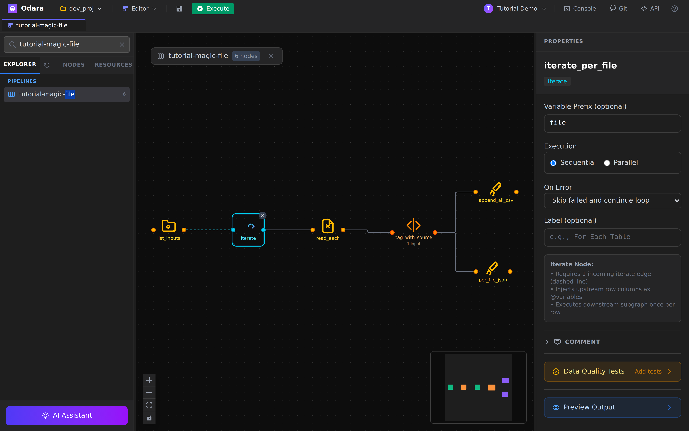
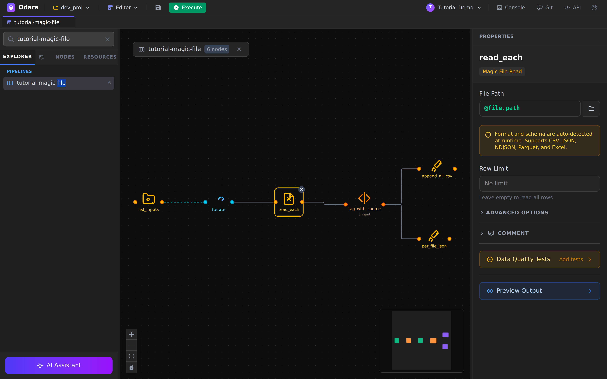
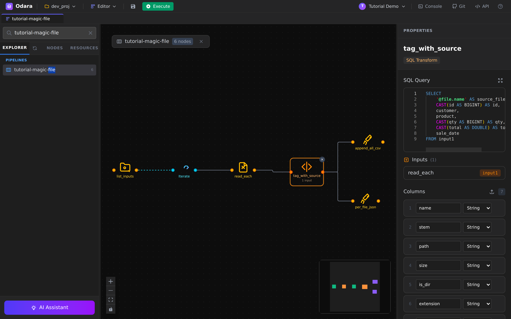
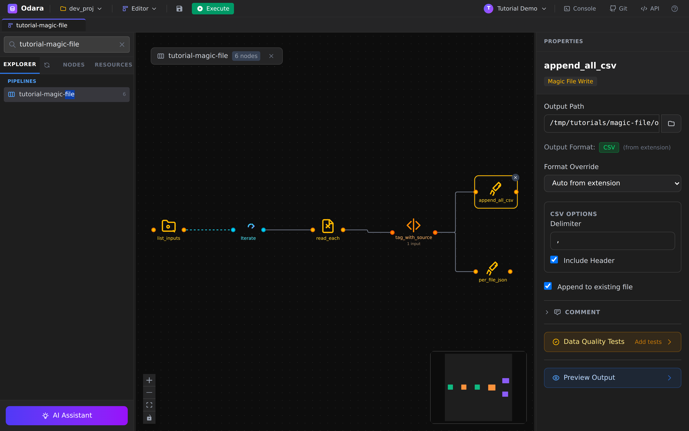
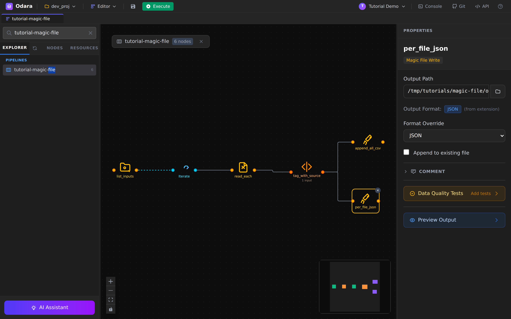
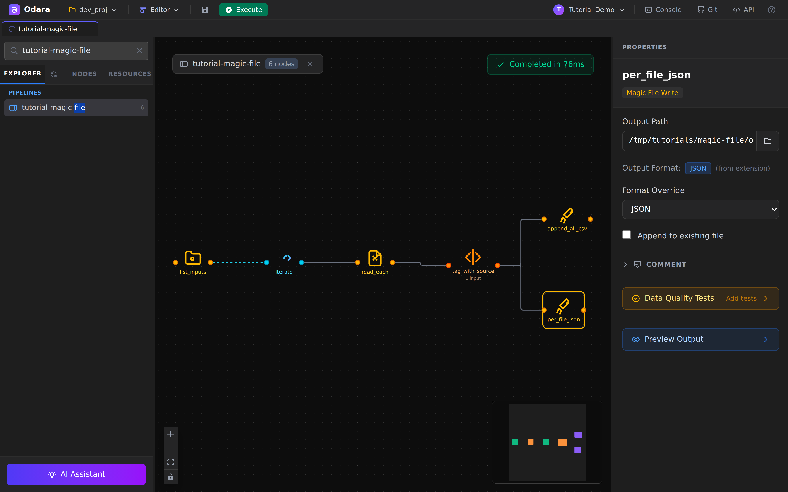
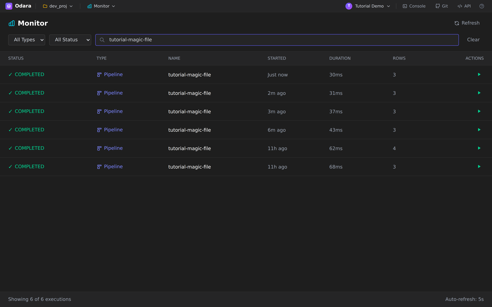
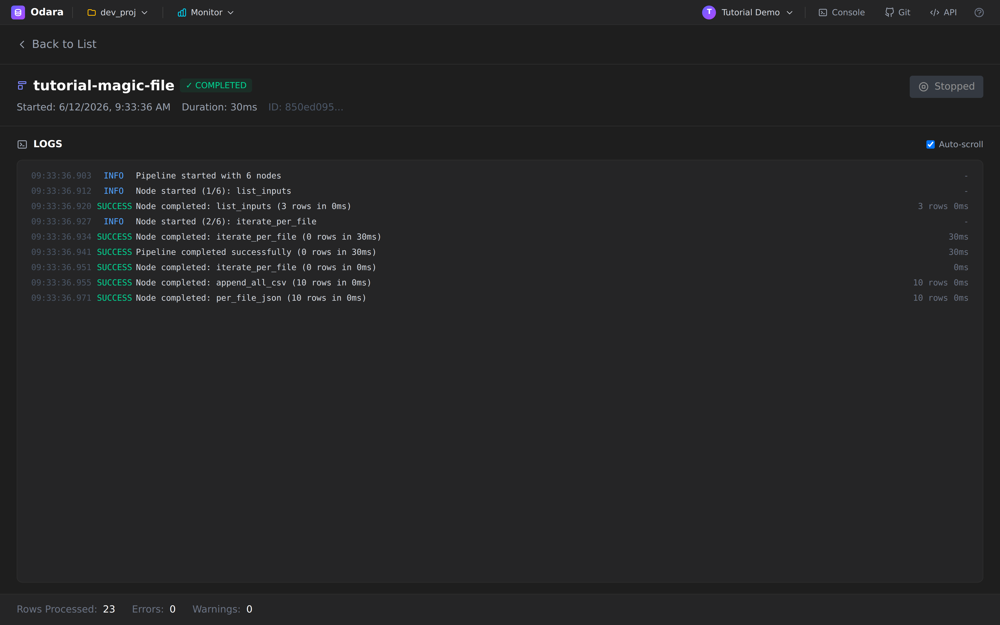

# Magic File + Iterate

> One line: point **FileList** at a folder containing a CSV, an Excel
> and a JSON file, let **Iterate** run the downstream graph once per
> file, and let **Magic File** auto-detect each format — every row
> lands in one consolidated CSV, tagged with the file it came from.

This walkthrough builds a pipeline that survives the messiest input
folder you can throw at it. Reading time **10 minutes**; running time
on the demo dataset is well under a second.

By the end you will know how to:

1. List a local folder with the **FileList** source
2. Wire the dashed **iterate edge** and loop the downstream subgraph
   once per file with the **Iterate** node
3. Read any of CSV / JSON / NDJSON / Parquet / Excel with a single
   **Magic File** source — no format configured anywhere
4. Use **`@file.*` variables** inside SQL queries and target paths
5. **Append** every iteration into one CSV, and write one JSON file
   per iteration at the same time

## Files

Download these three files — same columns, three different formats —
into a local folder. The example uses
`/tmp/tutorials/magic-file/inputs/`, but any absolute path on the
machine where Odara runs works:

- **[sales_jan.csv](./files/inputs/sales_jan.csv)** — January sales,
  plain CSV with a header row
- **[sales_feb.xlsx](./files/inputs/sales_feb.xlsx)** — February
  sales, an Excel workbook
- **[sales_mar.json](./files/inputs/sales_mar.json)** — March sales,
  a JSON array of objects

All three carry the same logical schema: `id`, `customer`, `product`,
`qty`, `total`, `sale_date` — 10 rows each. That's the point of the
exercise: same data, three encodings, one pipeline.

---

## 1. The shape of the pipeline

Six nodes. One source lists the folder, Iterate fans out per file,
and the per-file subgraph reads → normalises → writes to two targets.



Two things to notice before clicking anything:

- The edge between **list_inputs** and **iterate** is **dashed** —
  that's an *iterate edge*, a different kind from the solid *data
  edges* everywhere else. It means "feed me one row at a time", not
  "hand me the whole table".
- After the SQL Transform the graph **fans out to two targets**: the
  same normalised rows are appended to one consolidated CSV *and*
  written to a fresh JSON file per iteration.

---

## 2. FileList — list the folder

Click **list_inputs**. FileList is the simplest source in the
palette: give it a directory, get back one row per entry.



- **Directory** — `/tmp/tutorials/magic-file/inputs` (absolute path
  on the machine where the Odara API runs).
- **Pattern** — left empty here, so everything in the folder is
  listed. Set e.g. `*.csv` to filter.
- **Include files** ✓ / **Include directories** ✗ — we only want
  files; the output schema's `is_dir` column would let you filter
  downstream too, but unticking is cleaner.

The output schema is fixed and shown in the panel: `name`, `path`,
`size`, `is_dir`, `extension`, `modified_time` (plus `stem`, the
filename without extension — it will earn its keep in §6). With our
three files this source emits exactly **3 rows**.

> **Gotcha:** `Pattern` filters *files only* — directories are
> governed solely by the include-directories toggle.

---

## 3. Iterate — run the subgraph once per row

Click **iterate_per_file**. This is the control-flow heart of the
pipeline.



The info box in the panel summarises the contract:

- it requires **one incoming iterate edge** (the dashed one),
- it **injects the upstream row's columns as `@`-variables**,
- it **executes the downstream subgraph once per row**.

Three knobs:

- **Variable Prefix** — `file`. Each column of the incoming row
  becomes a variable named `@file.<column>`: `@file.path`,
  `@file.name`, `@file.stem`, and so on. Pick a prefix that reads
  well in the places you'll use it.
- **Execution** — `Sequential`. Files are processed one at a time, in
  listing order. `Parallel` runs iterations concurrently — faster,
  but don't combine it with an *appending* target unless you're
  happy with interleaved write order.
- **On Error** — `Skip failed and continue loop`. If one file is
  corrupt, the loop logs the failure and moves on to the next file
  instead of failing the whole run.

---

## 4. Magic File source — read without knowing the format

Click **read_each**. Here's the trick that makes one pipeline handle
three formats:



- **File Path** — `@file.path`. Not a real path: on each iteration,
  Iterate substitutes the current row's `path` column. First
  iteration reads `sales_feb.xlsx`, then `sales_jan.csv`, then
  `sales_mar.json` (listing order).
- **Format** — nowhere to be seen, and that's the feature. Magic
  File sniffs the **content** of the file (magic bytes + a sample of
  the head) and picks the right reader. It supports **CSV, JSON,
  NDJSON, Parquet and Excel**, and works even when the file has no
  extension at all.
- **Row Limit** — empty (read everything). Useful for smoke-testing
  a huge folder with `1000`.

---

## 5. SQL Transform — normalise and tag

Click **tag_with_source**. Three formats won't agree on types
(Excel hands you numbers, CSV hands you strings), so we cast
everything explicitly — and while we're here, we stamp each row with
the file it came from:



```sql
SELECT
    '@file.name' AS source_file,
    CAST(id AS BIGINT) AS id,
    customer,
    product,
    CAST(qty AS BIGINT) AS qty,
    CAST(total AS DOUBLE) AS total,
    sale_date
FROM input1
```

Two details worth a pause:

1. **`'@file.name'` inside the SQL string** — `@`-variables are
   substituted *before* the query reaches the SQL engine, so they
   work anywhere a literal works. On the first iteration the line
   compiles to `'sales_feb.xlsx' AS source_file`.
2. **The CASTs are the contract.** Whatever the source format did to
   the types, what leaves this node is always `BIGINT, BIGINT,
   DOUBLE` for the numeric columns. Without this, the consolidated
   CSV would silently mix `3` and `3.0` depending on which file a
   row came from.

---

## 6. Two Magic File targets

The same normalised rows go to two places at once.

### 6a. `append_all_csv` — one consolidated CSV



- **Output Path** — `/tmp/tutorials/magic-file/output/all_sales.csv`.
- **Output Format** — shows `CSV (from extension)`: on the write
  side, Magic File picks the format from the file extension (or you
  can force one with **Format Override**).
- **Append to existing file** ✓ — *this is what makes the loop
  accumulate.* Iteration 1 creates the file with a header; iterations
  2 and 3 append rows without repeating the header. Delete the output
  file before a re-run, or you'll keep accumulating across runs too.

### 6b. `per_file_json` — one JSON file per iteration



- **Output Path** —
  `/tmp/tutorials/magic-file/output/normalized_@file.stem.json`.
  `@`-variables work in target paths too: `@file.stem` expands to
  `sales_jan`, `sales_feb`, `sales_mar`, so each iteration writes its
  own file instead of overwriting one.
- **Format Override** — `JSON` (the `@` in the path means the
  extension isn't trustworthy at config time, so we say it
  explicitly).
- **Append** ✗ — each file is written fresh.

> **Note:** Odara's JSON writer emits **JSON Lines** (one object per
> line), not a single JSON array. That's the format BigQuery,
> DuckDB, and `jq` ingest natively; if you need an array, post-process
> with `jq -s '.' file.json`.

---

## 7. Execute

Hit **Execute** in the toolbar. With 30 rows across three files the
whole run takes a few dozen milliseconds — the toolbar flips straight
to the green completion badge:



---

## 8. Verify in Monitor

Switch to **Monitor** (top bar **Editor ▼** → **Monitor**). Each run
of the pipeline is one execution row:



Click the fresh run to read the trace:



Reading the LOGS panel top-to-bottom:

- `list_inputs` completed — **3 rows** (one per file in the folder)
- `iterate_per_file` started and drove the downstream subgraph once
  per row
- inside each iteration, `append_all_csv` and `per_file_json` each
  report **10 rows** — one file's worth

---

## 9. Verify on disk

```bash
$ ls /tmp/tutorials/magic-file/output/
all_sales.csv  normalized_sales_feb.json  normalized_sales_jan.json  normalized_sales_mar.json

$ head -4 /tmp/tutorials/magic-file/output/all_sales.csv
source_file,id,customer,product,qty,total,sale_date
sales_feb.xlsx,101,Isabel,Headphones,3,269.7,2025-02-10
sales_feb.xlsx,102,Isabel,USB-C Cable,1,14.5,2025-02-19
sales_feb.xlsx,103,Diana,Mouse Pad,1,22,2025-02-18

$ cut -d, -f1 all_sales.csv | sort | uniq -c
     10 sales_feb.xlsx
     10 sales_jan.csv
     10 sales_mar.json
      1 source_file
```

30 data rows, 10 from each format, every one tagged with its origin.
The `source_file` column is your lineage for free.

---

## Cheat sheet

| I want to… | Do this |
|---|---|
| Read a file whose format I don't control | **Magic File** source — leave the format alone, it sniffs the content. |
| Loop a pipeline over every file in a folder | **FileList** → dashed **iterate edge** → **Iterate** → your subgraph. |
| Reference the current file inside the loop | `@<prefix>.path`, `@<prefix>.name`, `@<prefix>.stem` — prefix set on the Iterate node. |
| Collect all iterations into one file | Magic File target + **Append to existing file** (and clean the output between runs). |
| Write one output file per iteration | Put `@<prefix>.stem` in the target's **Output Path**. |
| List only some files | FileList **Pattern** (e.g. `*.csv`) — it filters files, not directories. |
| Survive one bad file in the folder | Iterate **On Error = Skip failed and continue loop**. |
| Speed up a big folder | Iterate **Execution = Parallel** — but not with an appending target. |

---

## What you learned

- **Magic File detects formats by content**, not extension — one
  source node reads CSV, JSON, NDJSON, Parquet and Excel, even with
  no extension at all.
- The **iterate edge is its own edge kind** (dashed). FileList feeds
  Iterate one row at a time; everything after Iterate is a normal
  data graph that runs once per row.
- **`@`-variables go anywhere a literal goes** — file paths, SQL
  strings, target paths. That's what turns one static graph into a
  per-file loop.
- **Casts are the seam between formats**: normalise types in one SQL
  Transform and every downstream target sees a single, stable schema.
- **Append mode + `@stem` paths** give you a consolidated file and
  per-file outputs from the same run.

That closes the seven walkthroughs. From here every pipeline you
build is a remix: connectors, transforms, control flow, schedules,
alerts, orchestration — you've seen the building blocks.
