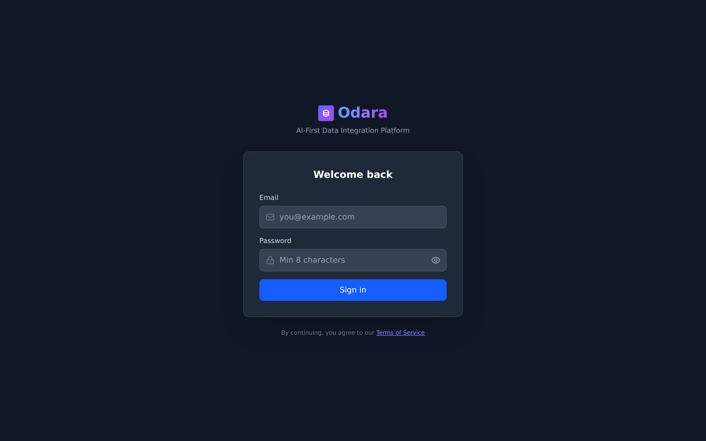
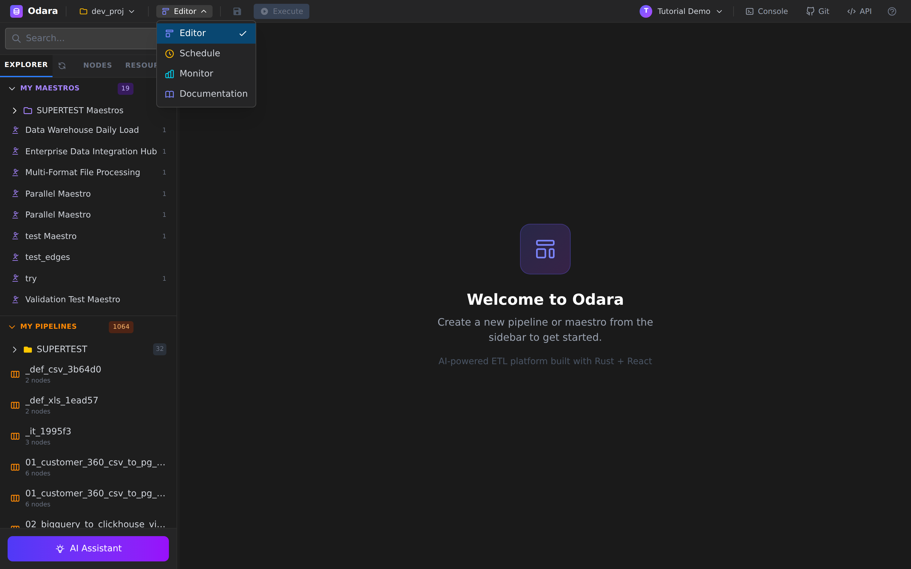
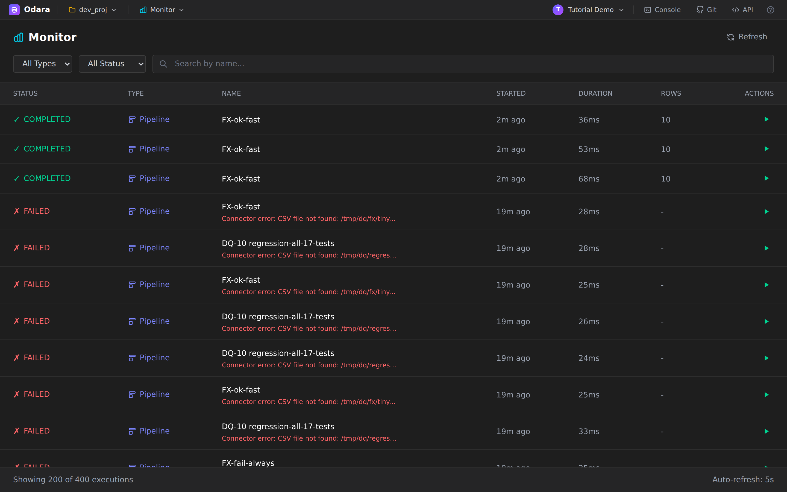
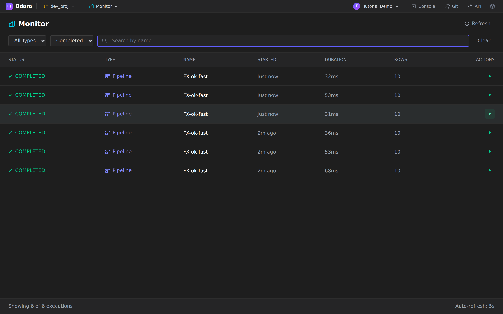
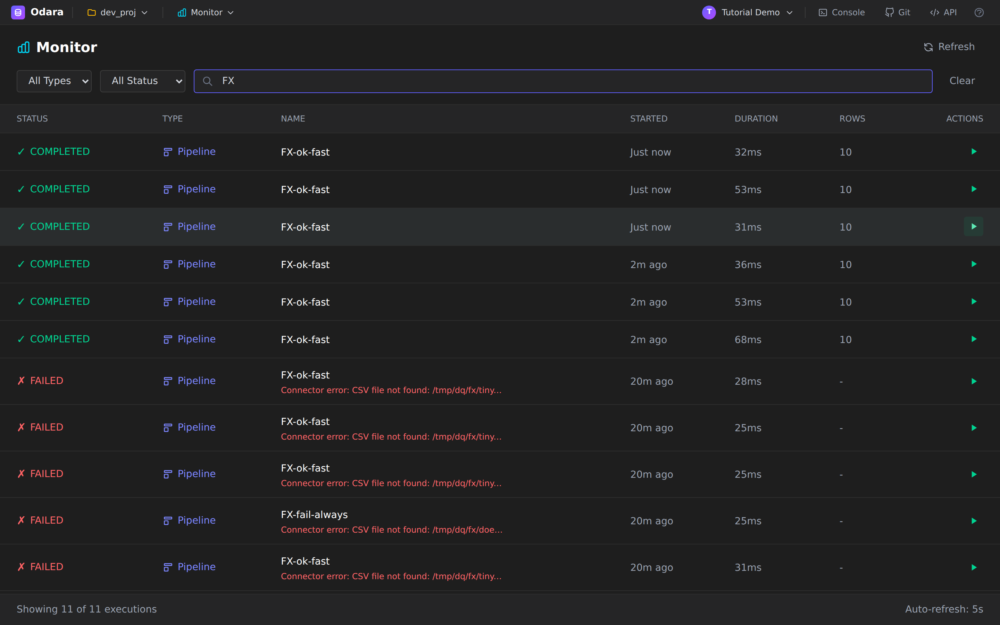
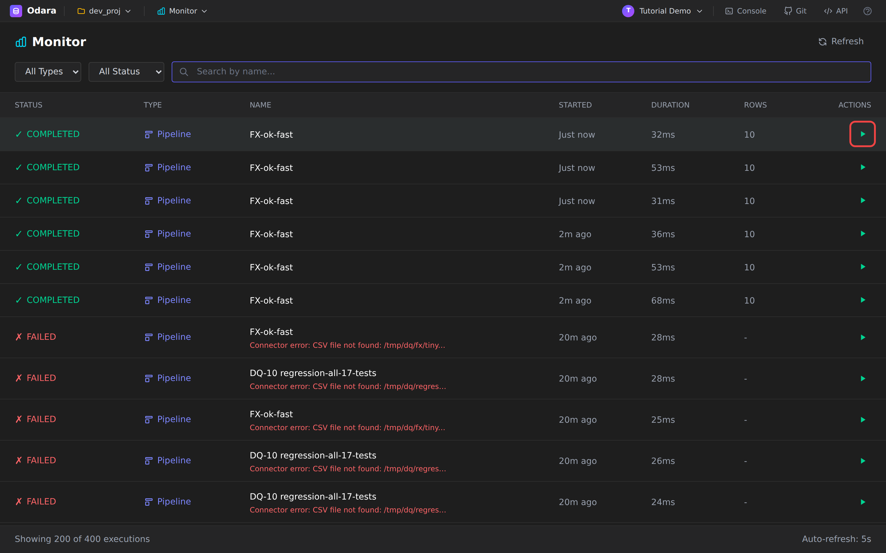
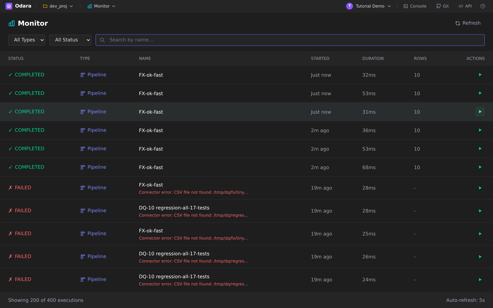
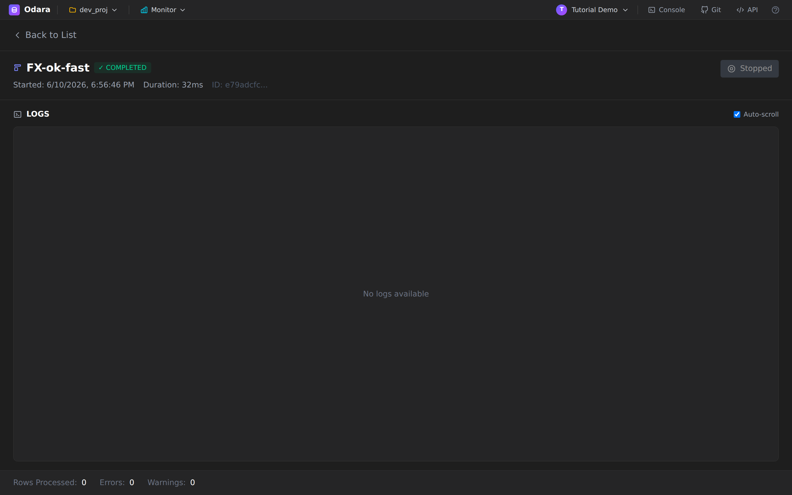
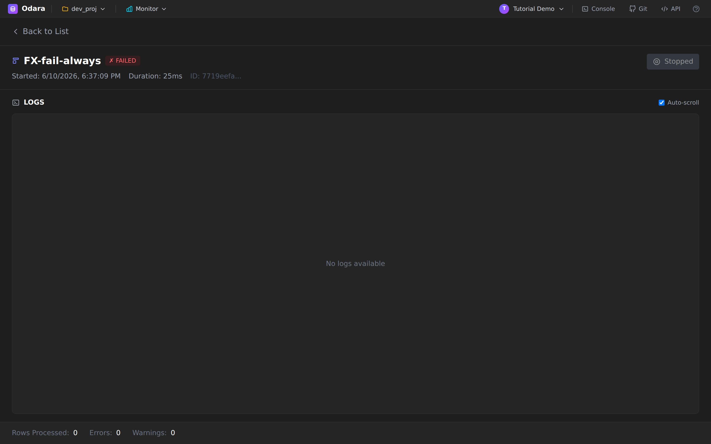

# Monitor

> One line: **Monitor** is the single page where every run of every
> pipeline and maestro shows up — succeeded, failed, or in flight —
> with one click to re-run and one click to see what happened.

This tutorial walks through Monitor end to end on a fresh install,
using the bundled `tutorial@odara.local` account. You'll learn how to:

1. Open Monitor
2. Read the list
3. Filter and search
4. Re-run an execution
5. Open the execution detail
6. Understand when logs appear (and when they don't)

It takes about **6 minutes**.

---

## 1. Sign in

Start the app (`./start-dev.sh` from the repo root, or the production
binary), then open <http://localhost:5175>. You'll land on the sign-in
screen.

Enter your credentials and click **Sign in**. If you're following
along with the demo seed, that's `tutorial@odara.local`.

---

## 2. Open Monitor

There is no top-level **Monitor** link in the sidebar. Monitor lives
inside the workspace switcher in the header — click **Editor ▼** in
the top bar and pick **Monitor**.

The workspace title in the header will switch from **Editor** to
**Monitor**, and the page changes to a single table that lists every
execution from every pipeline and every maestro in the current
project.

---

## 3. Read the list

Every row is **one run** (an `execution_id`, in the database). The
columns:

| Column      | What it means                                                   |
| ----------- | --------------------------------------------------------------- |
| **Status**  | `✓ Completed` · `✗ Failed` · `Running` · `Stopped` · `Queued`    |
| **Type**    | `Pipeline` or `Maestro` — a maestro can fan out into N pipelines |
| **Name**    | Pipeline/maestro name. On failed runs, the error message shows below it. |
| **Started** | Relative time (`Just now`, `2m ago`, `19m ago`).                 |
| **Duration**| Wall-clock from `started_at` to `completed_at`.                  |
| **Rows**    | Total rows processed by the run. `-` if nothing was processed (early failure, or no rows). |
| **Actions** | A green ▶ to re-run the same execution.                          |

The footer shows two things you should know about:

- **`Showing 200 of 400 executions`** — the list paginates at 200.
  Use the filters above to narrow it down.
- **`Auto-refresh: 5s`** — the page polls every 5 seconds. Anything
  that fires (scheduler, manual run, child of a maestro) shows up
  here within 5s without a reload.

---

## 4. Filter and search

Three controls at the top: **All Types**, **All Status**, and a
search box that matches the pipeline/maestro name.

### By status

The status dropdown is the quickest way to triage. Pick **Completed**
to see only what worked:

Notice the footer now reads `Showing 6 of 6 executions`. The dataset
narrowed from 400 down to the runs that match. A **Clear** button
appears on the right to drop the filter.

### By name

Type a fragment of the pipeline name in the search box. Matching is
case-insensitive and substring:

You can combine filters: `Type = Pipeline` + `Status = Failed` +
`search = customers` is a common triage query when something breaks
overnight.

---

## 5. Re-run an execution

Every row has a green ▶ in the **Actions** column. Click it to
re-trigger the same pipeline (same config, same inputs) without
leaving Monitor.

A new row appears at the top of the list within 1-2 seconds. If the
run is fast (most ETL pipelines under a few seconds), you'll see it
in **Just now** with its final status almost immediately. If it's a
long-running pipeline, you'll see it pass through **Running** and
update on each auto-refresh.

> **Tip:** if a run failed because of a transient issue (network blip,
> a CSV that wasn't on disk yet), the ▶ button is the fastest way to
> verify a fix without reopening the Editor.

After three re-runs you can see the three fresh `COMPLETED` rows at
the top, with the old `FAILED` runs preserved below for history:

---

## 6. Open the execution detail

Click anywhere on a row (except the ▶ button) to open the detail
page for that execution.

The header gives you the essentials:

- **Pipeline name** and **status badge**
- **Started** (full timestamp, not relative)
- **Duration** (wall-clock)
- **Execution ID** (a UUID — copy it if you need to grep the backend logs)
- **Stopped** button on the right — only active for runs that are still in flight; clicking it cancels the run via the abort endpoint.

Below the header is the **LOGS** panel. The footer shows three
running tallies: **Rows Processed**, **Errors**, **Warnings**.

### A note about logs

The LOGS panel streams the per-node log lines from the engine **while
a run is in flight**. Once the run finishes, the streaming connection
closes and the panel shows **No logs available** for re-opened
detail pages. This is by design — Monitor today is a live cockpit
rather than a log archive.

If you need the full log of a finished run, you have two options:

1. **Re-run** the same execution with the ▶ button and keep the detail
   page open while it runs — you'll see every log line live.
2. **Server logs** — the API process writes structured logs to stdout
   (you'll find pipeline start/finish, scheduled job results, and
   error details there). On the dev server that's the terminal where
   `start-dev.sh` is running.

Click **← Back to List** in the top-left to return.

---

## 7. Read a failed execution

When a row's status is `✗ FAILED`, the **Name** column inlines the
first line of the error so you can triage without opening the
detail. Click the row anyway when you want the metadata:

Same layout, red badge. For failed runs the **Rows Processed**
counter at the bottom is often `0` — it means the engine failed
before reading the source. Errors that happen mid-stream (some
target writes succeed, then a later write blows up) will show
`Rows Processed > 0` and `Errors > 0`.

---

## What's next

- **Schedule** — set a pipeline or maestro to run on a cron and have
  alerts emailed on failure. (See the [Schedule tutorial](../schedule/).)
- **Admin** — manage connections, projects, and users. (See the
  [Admin tutorial](../admin/).)

---

## Cheat sheet

| Action                          | How                                  |
| ------------------------------- | ------------------------------------ |
| Open Monitor                    | Header → **Editor ▼** → **Monitor**  |
| Triage failures                 | Status filter → **Failed**           |
| Find one pipeline               | Search box (substring, case-insensitive) |
| Re-run                          | Green ▶ on the row                    |
| See execution metadata          | Click the row                        |
| See live logs                   | Open detail **while** it's running    |
| Cancel a running execution      | Detail page → **Stopped** button     |
| Refresh                         | Auto every 5s, or **Refresh** top-right |
