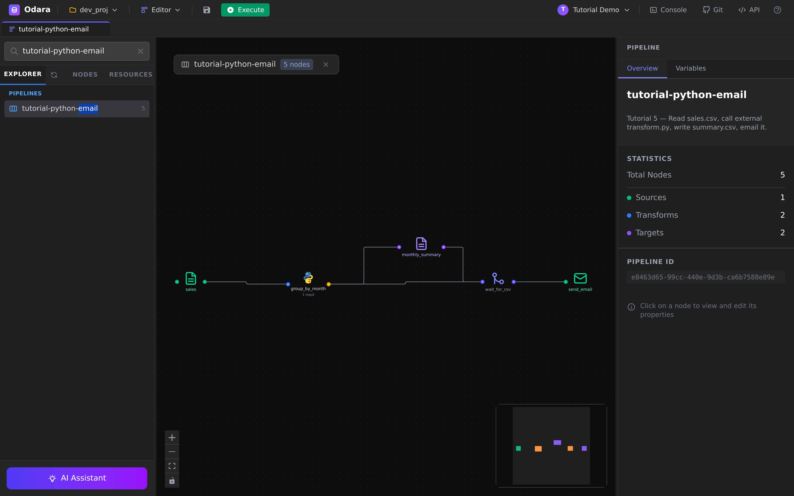
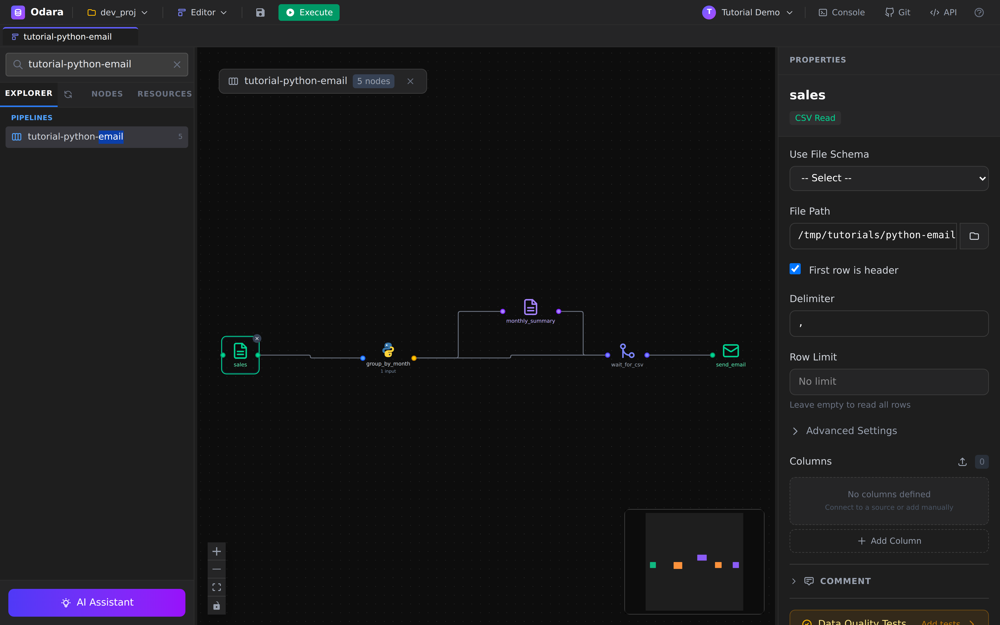
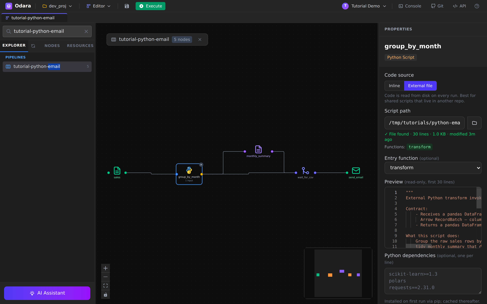
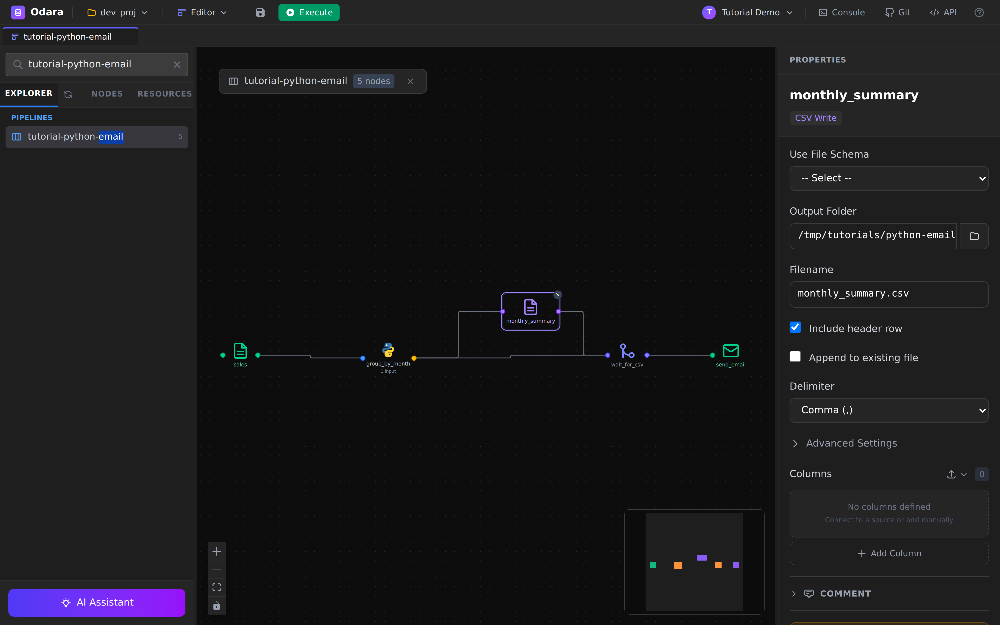
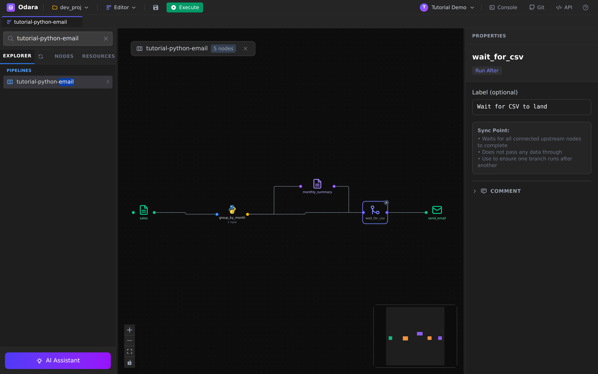
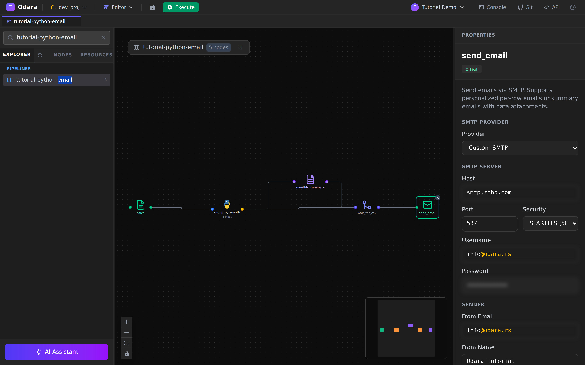
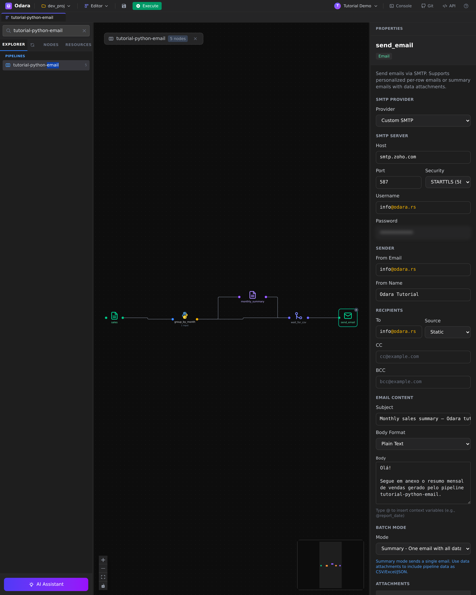
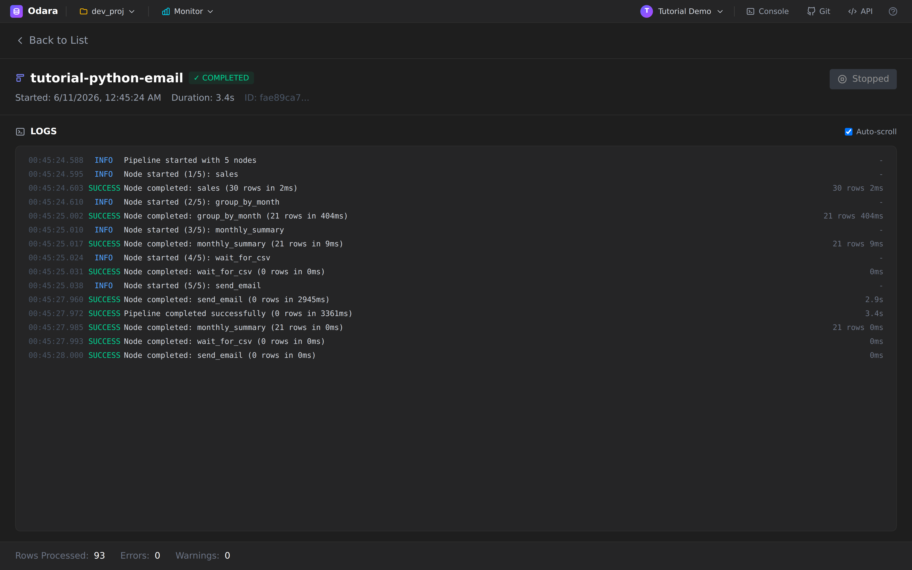

# Python external + Email

> One line: read a CSV, hand it to an **external Python file** that
> aggregates the rows with pandas, write the output to disk, and **email
> the file as an attachment** — all driven by Odara's `python_transform`
> and `email_target` nodes.

This walkthrough builds a five-node pipeline that finishes end-to-end
in under four seconds against the demo dataset. Reading time **10
minutes**.

By the end you will know how to:

1. Point a `python_transform` node at an **external `.py` file** (not
   inline code) and choose the entry function
2. Use a **`run_after` barrier** so the email step waits for the CSV
   to actually land on disk before reading it as an attachment
3. Configure SMTP **inline** in an `email_target` node — host, port,
   security, credentials, from / to, subject, body, **attachments**
4. Read the full per-node trace in Monitor after the run

## Files

Download these into a folder on the same machine as the Odara API
(the example uses `/tmp/tutorials/python-email/`):

- **[sales.csv](./files/sales.csv)** — 30 rows of fake sales
  (sale_id, sale_date, region, product, amount)
- **[transform.py](./files/transform.py)** — pandas aggregation
  function called by the Python node

Open `transform.py` once before you start — the contract is short:

```python
import pandas as pd

def transform(df: pd.DataFrame) -> pd.DataFrame:
    df = df.copy()
    df["sale_date"] = pd.to_datetime(df["sale_date"])
    df["month"] = df["sale_date"].dt.strftime("%Y-%m")
    df["amount"] = pd.to_numeric(df["amount"])
    return (
        df.groupby(["month", "region"], as_index=False)
          .agg(orders=("sale_id", "count"),
               total_amount=("amount", "sum"))
          .sort_values(["month", "region"])
          .reset_index(drop=True)
    )
```

Odara hands the upstream batch to `transform(df)` as a pandas
DataFrame, gets a DataFrame back, and turns it into an Arrow batch
for the downstream nodes. No extra glue code needed.

---

## 1. The shape of the pipeline

Five nodes in a fan-out / fan-in arrangement:



```
sales (CSV)
  └─→ group_by_month (Python)
         ├─→ monthly_summary (CSV target)
         └─→ wait_for_csv (RunAfter) ←──── monthly_summary
                                  └─→ send_email (Email target)
```

The `wait_for_csv` node is the key idea: it's a control-flow barrier
that waits for **all** of its upstream nodes (`group_by_month` and
`monthly_summary`) to finish before the email step can start. Without
this, `send_email` and `monthly_summary` would race — the email would
try to attach a file the CSV target hadn't written yet.

---

## 2. CSV source — `sales`



Same shape as any CSV source. Three columns matter for our pipeline:
`sale_date` (parsed by the Python script), `region` (used as the
group key), and `amount` (summed).

---

## 3. Python Transform — pointed at the external file

This is the interesting node.



The Properties panel shows three switches that matter:

- **Code source** toggle — **`Inline`** stores the code in the
  pipeline JSON (good for one-off scripts, lives with the pipeline).
  **`External File`** reads the code from disk on every run (good for
  shared scripts, source-controlled in another repo).
- **Script path** — the absolute path to `transform.py`. The panel
  validates: **`✓ File found · N lines · M KB · modified Mago`** and
  lists every function it discovered.
- **Entry function** — which top-level function Odara calls. If left
  blank Odara auto-discovers `transform`, then `process`, then
  `run`, in that order. Pick one explicitly when your script has
  multiple candidates.

A small **Preview** below shows the first lines of the file so you
can verify Odara is reading what you expect.

> **Python dependencies**: the panel has a `Python dependencies`
> field where you can list pip requirements (one per line, e.g.
> `pandas>=2.0`, `scikit-learn`). On first run Odara `pip install`s
> them into the executor venv and caches the result; subsequent runs
> are zero-cost.

> **The data contract**: the function receives a **pandas
> `DataFrame`** (one Arrow batch is auto-converted). Whatever
> DataFrame it returns becomes the next stage's batch. Column names
> and dtypes are preserved.

---

## 4. CSV target — `monthly_summary.csv`



The CSV target writes whatever the Python node returned to disk. We
point it at `/tmp/tutorials/python-email/monthly_summary.csv`. After
the run, `head` on that file shows:

```csv
month,region,orders,total_amount
2024-01,North,2,3657.14
2024-01,South,1,2274.91
…
```

---

## 5. The barrier — `wait_for_csv`



`wait_for_csv` is a **RunAfter** node — it produces no data, has
nothing to configure beyond an optional label, and its only job is
to wait for every upstream node to finish before downstream nodes
get scheduled.

In this pipeline two edges feed into it:
`group_by_month → wait_for_csv` and `monthly_summary → wait_for_csv`.
The downstream edge `wait_for_csv → send_email` is therefore
guaranteed to fire **after** `monthly_summary` has finished writing
the file to disk. No more race.

---

## 6. Email target — `send_email`

The longest node configuration we'll see — but every group is
sensibly labelled.



The panel groups the fields by concern:

| Group | Fields |
|---|---|
| **SMTP Server** | Provider preset (Gmail / Outlook / SendGrid / SES / Custom), Host, Port, Security (`STARTTLS` / `TLS` / `None`), Username, Password |
| **Sender** | From Email, From Name |
| **Recipients** | To, To Source (`Static` / `From Column`), CC, BCC |
| **Email Content** | Subject, Body Format (`Plain Text` / `HTML`), Body |
| **Batch Mode** | `Per Row` (one personalised email per input row) or `Summary` (one email, the upstream data is the attachment) |
| **Attachments** | A list of `Static File` (a fixed path) or `From Column` (path read off the input data) |

Scroll the panel down and you reach the **Recipients**, body, mode,
and attachment configuration:



For this tutorial we use:

- **Provider preset** = `Custom SMTP` (so Host, Port, Security are
  editable; the Gmail preset would lock them down to `smtp.gmail.com
  :587 STARTTLS`).
- **Batch Mode** = `Summary` — exactly one email is sent regardless
  of input row count.
- **Attachments** = one `Static File` pointing at
  `/tmp/tutorials/python-email/monthly_summary.csv`. The filename
  the recipient sees is `monthly_summary.csv` (set in the optional
  `filename` field).

Passwords are stored encrypted at rest (AES-GCM) and only ever
displayed as `●●●●●●` once saved.

---

## 7. Run it

Click **Execute** in the toolbar. The pipeline finishes in about
**3.5 seconds** end-to-end — Python aggregation (~400 ms), CSV write
(< 10 ms), SMTP round-trip (~3 s).



Reading the log trace:

- `sales` — `30 rows in 2ms` (CSV read)
- `group_by_month` — `21 rows in 404ms` (Python startup + pandas
  aggregation; the first invocation is slower because the runtime
  has to spawn the Python subprocess and import pandas — subsequent
  runs reuse the warm interpreter)
- `monthly_summary` — `21 rows in 9ms` (CSV write)
- `wait_for_csv` — `0 rows in 0ms` (barrier, no work)
- `send_email` — `0 rows in 2945ms` (one email, network-bound)

`Rows Processed: 93` at the bottom is the sum across all stages
(30 + 21 + 21 + 0 + 21 = 93). The number of recipients reached is
**1**, derivable from the `send_email` line and the static `To`
field.

---

## 8. Verify

Two checks:

1. **The CSV is on disk**:
   ```bash
   head /tmp/tutorials/python-email/monthly_summary.csv
   ```
2. **The email arrived**. Check the `info@odara.rs` inbox (or
   whichever address you put in **To**). Subject:
   *"Monthly sales summary — Odara tutorial"*; attachment:
   `monthly_summary.csv` (533 bytes for the demo dataset).

If the email never shows up, the most common causes:

- **STARTTLS vs TLS mismatch** — Zoho/Gmail want STARTTLS on port
  587; some hosts force TLS on 465. The error message in Monitor
  will say `connection refused` or `STARTTLS not advertised`.
- **App password vs account password** — Gmail/Outlook block plain
  account passwords for SMTP. Generate an app password in the
  provider's security settings.
- **Sender domain not authorised** — if `from_email` is on a
  different domain than `username`, some providers reject the
  message. Use the same domain.

---

## Cheat sheet

| I want to… | Do this |
|---|---|
| Call my own `.py` file instead of inline code | Python node → Code source → **External File** → set Script path |
| Pick a specific function in a file with several | Python node → **Entry function** dropdown |
| Pip-install a library on first run | Python node → **Python dependencies** (one per line) |
| Make node B wait for node A's side-effect | Insert a **RunAfter** node between them; wire both into it |
| Send the same email regardless of row count | Email node → **Batch Mode = Summary** |
| Send a personalised email per row | Email node → **Batch Mode = Per Row** + `To Source = From Column` |
| Attach a fixed file | Email node → **Attachments → Static File** |
| Attach a file whose path is in the data | Email node → **Attachments → From Column** + pick the column |
| Use Gmail / Outlook / SendGrid / SES | Email node → **Provider preset** (locks host/port/security) |

---

## What you learned

- An **external Python file** behaves like inline code from the
  pipeline's point of view — same DataFrame in, DataFrame out — but
  lives in your normal source tree and benefits from your normal
  review tooling.
- **`run_after`** is the right tool whenever a downstream node needs
  to wait on a side-effect of an upstream node (file write, table
  truncate, API call) that the executor can't otherwise see.
- The **Email target** is a real connector with the full credentials
  story — encrypted-at-rest passwords, provider presets, batch
  modes — not a "fire and pray" notifier.
- Pipeline summary counters (`Rows Processed`) accumulate over all
  nodes — derive *output* row counts from the `target` line, not
  the footer.

### Next

→ **[Star Schema → Snowflake — orchestrating multiple loads with Maestro](../star-schema/)**
