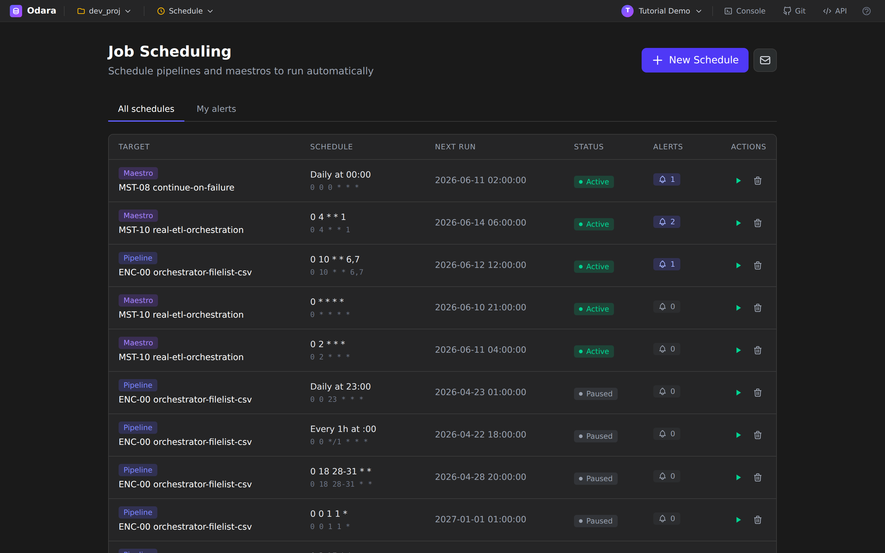
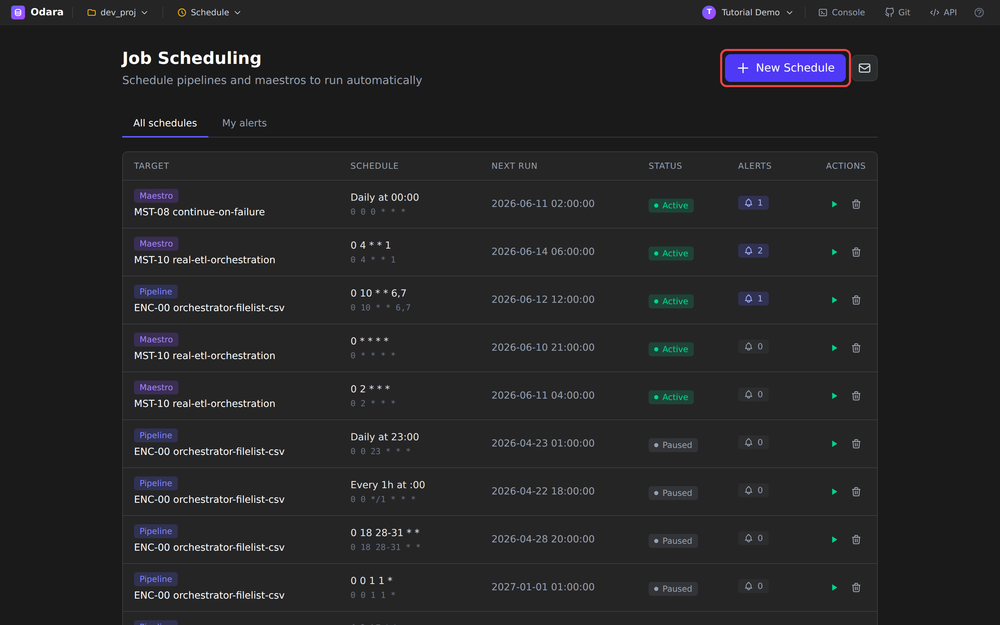
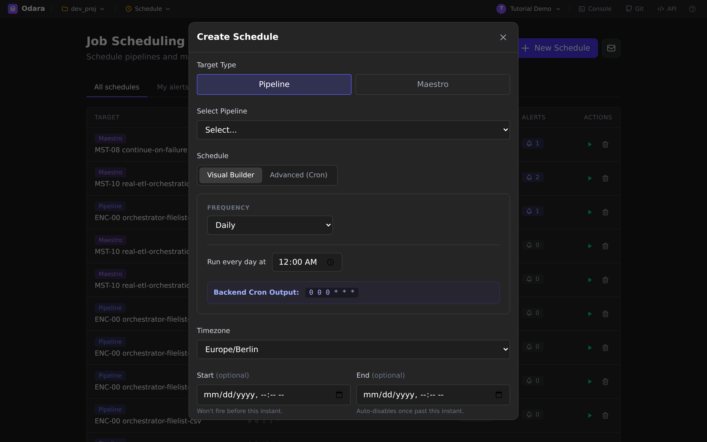
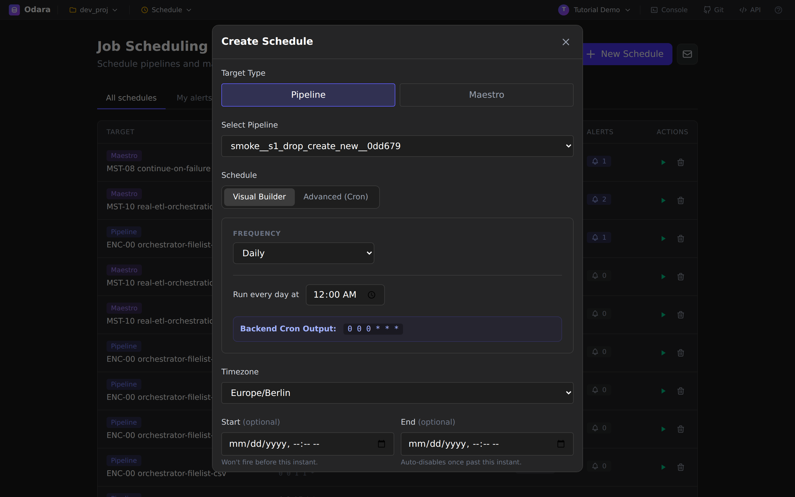
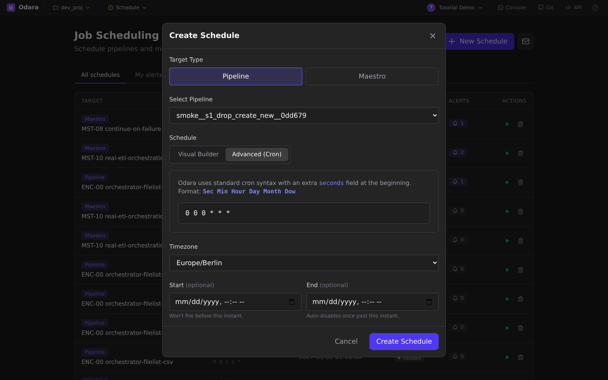
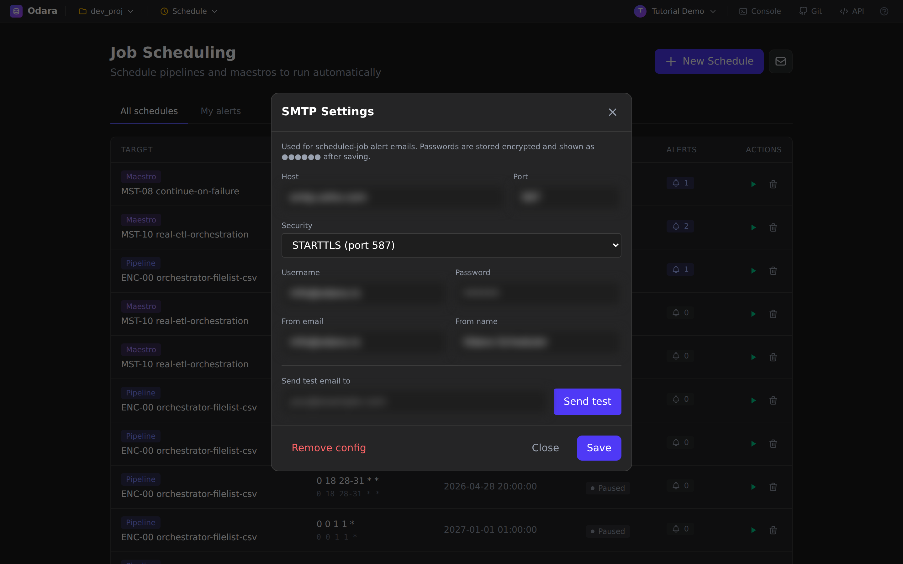
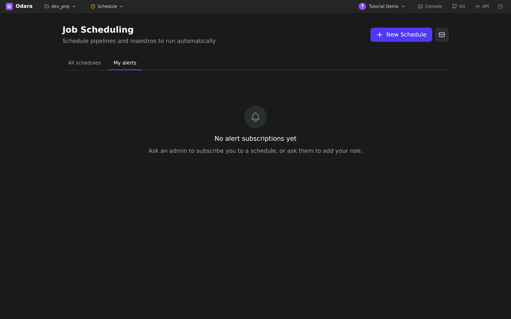
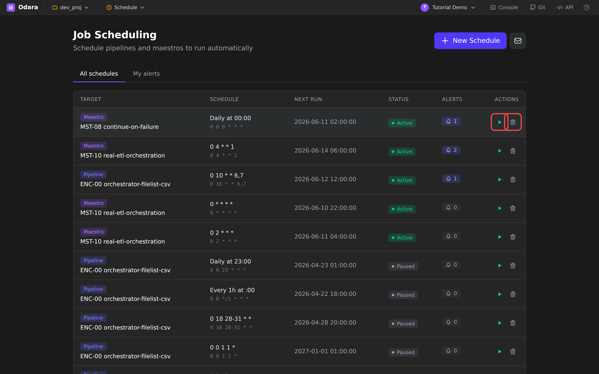

# Schedule

> One line: **Schedule** is where you tell Odara *when* a pipeline or
> maestro should run on its own — daily, hourly, on a custom cron — and
> who gets emailed when something goes wrong.

This tutorial walks through Schedule end to end on a fresh install,
using the bundled `tutorial@odara.local` account. You'll learn how to:

1. Open Schedule
2. Read the schedule list
3. Create a daily schedule (Visual Builder)
4. Switch to advanced cron mode
5. Configure email alerts (SMTP + subscriptions)
6. Pause, run-now, or delete a schedule

It takes about **7 minutes**.

---

## 1. Sign in

Open Odara at your install URL (the dev default is
`http://localhost:5175`) and sign in with the tutorial account:

- **Email:** `tutorial@odara.local`
- **Password:** `tutorial-demo-2026`

> If your install does not have the tutorial user, any regular user
> account works — you just need permission to view schedules.

---

## 2. Open Schedule

In the top bar, click the **Editor** dropdown (between the project
selector and the user menu) and choose **Schedule**.

You land on the **Job Scheduling** page. The header reads
*"Schedule pipelines and maestros to run automatically."* Below the
header are two tabs:

- **All schedules** — every schedule in this project.
- **My alerts** — the schedules where *you* are subscribed to receive
  email notifications.

The table shows, for each schedule:

| Column | What it tells you |
|---|---|
| **Target** | A pill (`Pipeline` or `Maestro`) plus the name of the job that will run. |
| **Schedule** | A human-readable line ("Daily at 00:00", "Every 1h at :00", "0 4 * * 1") plus the underlying cron in muted text. |
| **Next run** | The next absolute date/time the scheduler will fire. |
| **Status** | `Active` (will run) or `Paused` (frozen). |
| **Alerts** | How many users are subscribed to email notifications for this schedule. |
| **Actions** | Run-now (▶) and delete (🗑) — visible on hover. |

---

## 3. Create a schedule — Visual Builder

The most common case ("run this pipeline every day at midnight") never
needs you to write a cron expression. Click the purple **+ New Schedule**
button in the top-right.

The **Create Schedule** modal opens. It has two modes — *Visual Builder*
and *Advanced (Cron)* — toggled by the buttons just under the title.
Visual Builder is the default.

Fill in three things:

1. **Target type** — Pipeline or Maestro. Switch the toggle if you want
   to schedule an orchestrated maestro instead of a single pipeline.
2. **Pipeline** (or **Maestro**) — pick the job from the dropdown.
3. **Frequency** — Daily, Hourly, Weekly, Monthly, Every-N-minutes.

The preview line at the bottom (*"Runs daily at 00:00"*) always shows
the schedule in plain English plus the equivalent cron in muted text,
so you can sanity-check before saving.

### Trying a different frequency

Switch the **Frequency** dropdown to something other than Daily — say,
*Hourly* — and the form rebuilds itself around the new options
(minute-of-hour input, weekday selector, etc.).

The preview updates live so you can see what the new pick translates to
before saving.

---

## 4. Advanced — write the cron yourself

For anything Visual Builder cannot express — *"every weekday at 4 a.m.
except Wednesdays"*, *"every 15 minutes between 9 and 17"* —
click **Advanced (Cron)** at the top of the modal.

The form collapses down to a single text input. Type a standard
5-field cron (`min hour day-of-month month day-of-week`). A few quick
examples:

| Cron | Means |
|---|---|
| `0 0 * * *` | Daily at midnight |
| `*/15 * * * *` | Every 15 minutes |
| `0 9 * * 1-5` | 09:00 every weekday |
| `0 4 1 * *` | 04:00 on the 1st of every month |

The preview line still translates your cron back to English ("Runs at
04:00 on day 1 of every month") so a typo doesn't quietly become a
schedule that fires at the wrong time.

When the preview matches what you want, hit **Save**. The modal closes
and your new entry appears in the table, **Active** by default with a
populated **Next run** column.

---

## 5. Email alerts

Odara can email you when a scheduled job finishes — every time, on
failure only, or never. Alerts are a two-step thing:

1. **Configure SMTP once** (admin task — the server needs to know how
   to send mail).
2. **Subscribe per-schedule** (each user picks which schedules they
   care about).

### Open the alerts configuration

Click the small **envelope** icon to the right of the **+ New Schedule**
button.

The **SMTP Settings** dialog opens. The credential fields
(Host, Username, From email, etc.) are blurred in this screenshot —
on your own install they are plain text while editing, but **passwords
are stored encrypted and only ever displayed as `●●●●●●` after saving**.

Fill in your provider's details (Gmail, SendGrid, your company's
Postfix, anything that speaks SMTP), pick the right **Security** mode
(STARTTLS for port 587, SSL/TLS for port 465, or none for port 25 on a
trusted internal relay), and click **Save**.

The **Send test** field lets you fire a one-shot test email to any
address — useful for confirming the server can actually reach the
internet before you wait for a 2 a.m. job to fail.

### My alerts

Once SMTP is configured, every user can switch to the **My alerts** tab
to see which schedules they are subscribed to:

On a fresh install the tab is empty — *"No alert subscriptions yet.
Ask an admin to subscribe you to a schedule, or ask them to add your
role."* Admins do the subscribing from the **All schedules** tab.

> **Why admin-mediated?** Schedules notify users by name or by role
> (e.g. "everyone in the `data-ops` group"), and only admins can read
> the user list and edit role memberships. Regular users can always
> *unsubscribe* themselves.

---

## 6. Pause, run-now, delete

Hover any row in **All schedules** and two icons appear on the right
of the **Actions** column:

- ▶ **Run now** — fires the schedule immediately, regardless of its
  next scheduled time. The run shows up in **Monitor** the same way an
  on-time fire would.
- 🗑 **Delete** — removes the schedule. The underlying pipeline or
  maestro is untouched; only the schedule entry goes away.

To **pause** a schedule without deleting it, click the row to open
its detail panel and toggle **Active → Paused**. Paused schedules
keep their cron and their alert subscriptions, they just don't fire
until you flip them back to **Active**.

---

## Cheat sheet

| I want to… | Do this |
|---|---|
| Run a pipeline every day at 3 a.m. | New Schedule → Visual → Daily → 03:00 |
| Run something every 15 minutes | New Schedule → Advanced → `*/15 * * * *` |
| Run on weekdays only | Advanced → `0 9 * * 1-5` |
| Fire a one-off test run | Hover the row → click ▶ |
| Stop a schedule temporarily | Open the row → toggle to **Paused** |
| Get an email on failure | Configure SMTP → admin subscribes you on that schedule |
| Stop getting an email | **My alerts** tab → unsubscribe |
| Delete a schedule | Hover the row → click 🗑 |

---

## What you learned

- Schedule is the single place every cron lives — daily, hourly, or
  custom — for both pipelines and maestros.
- Visual Builder covers the common cases without writing cron;
  Advanced (Cron) handles everything else.
- Schedules can be **Active** or **Paused** without losing their
  config.
- Alerts have two layers — SMTP (once, by an admin) and per-schedule
  subscriptions (per user) — and admins manage who is subscribed to
  what.

### Next

→ **[Admin — manage users, roles, and projects](../admin/)**
