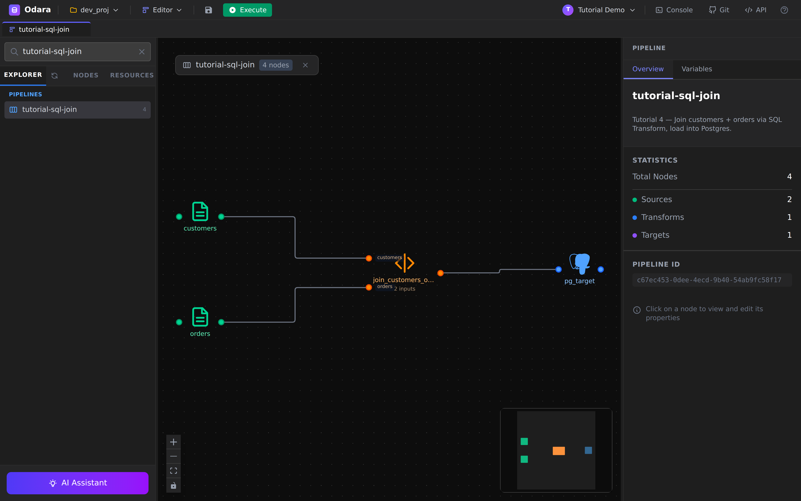
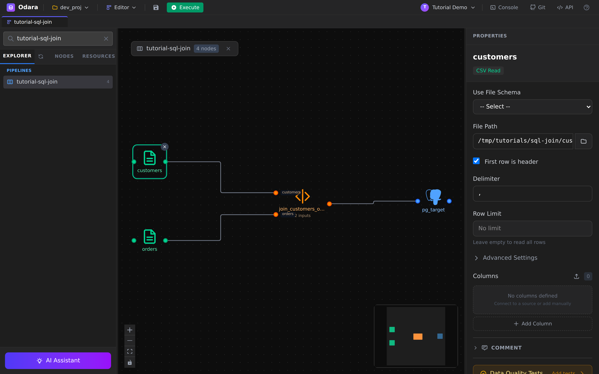
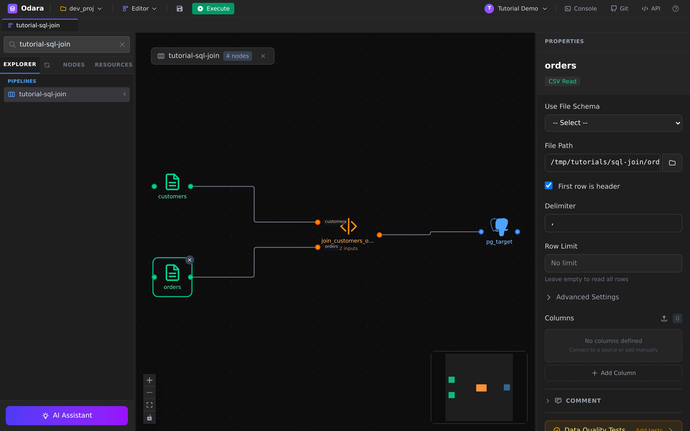
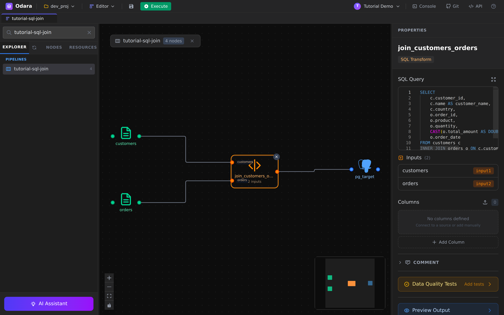
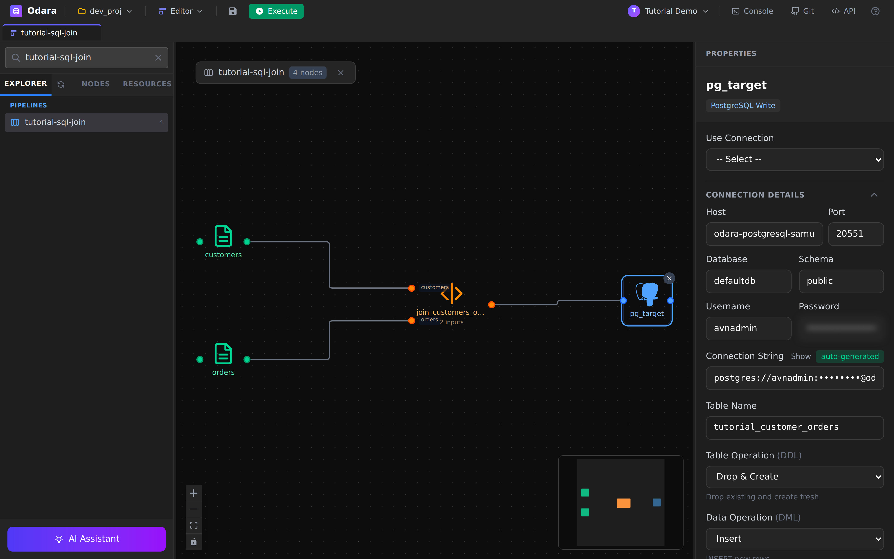
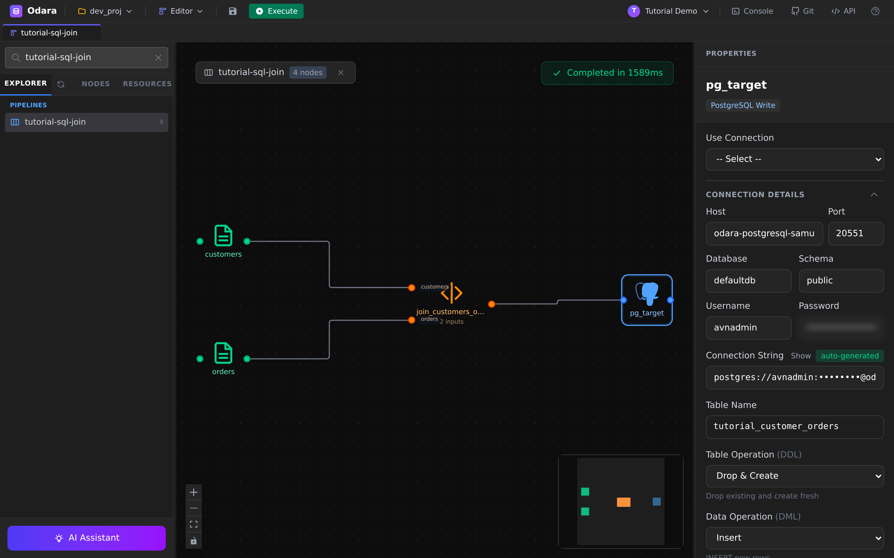
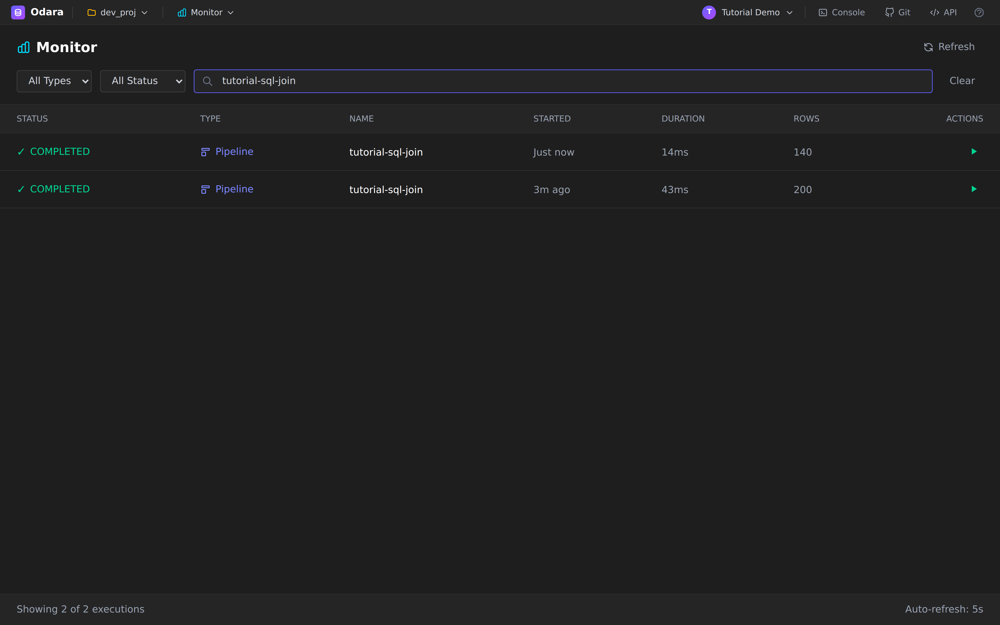
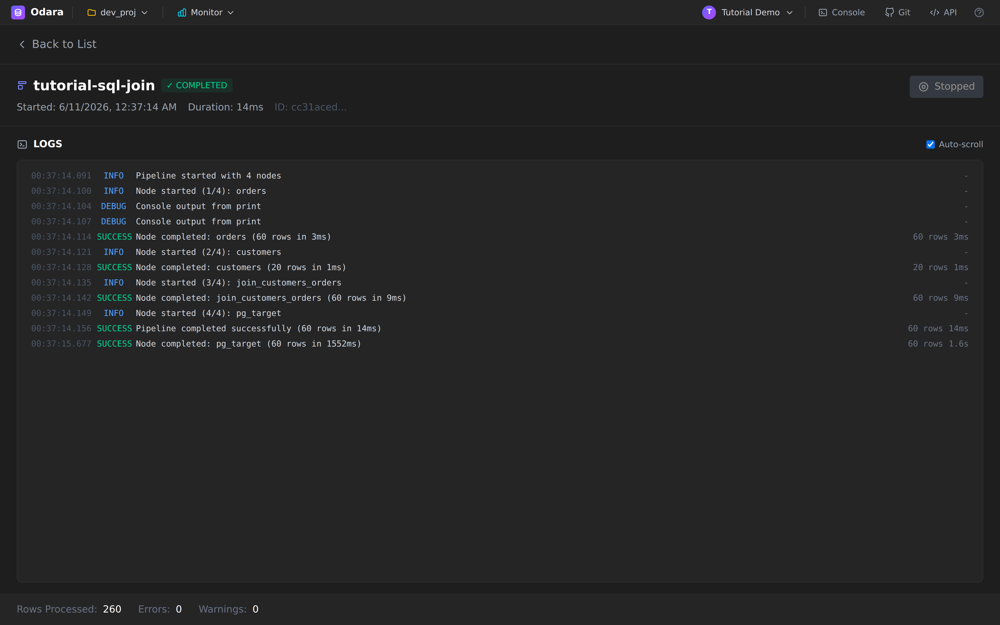

# SQL Join → Postgres

> One line: pull two CSV files in parallel, **JOIN** them inside a
> single SQL Transform, and write the joined rows into a Postgres
> table — all with four nodes and no Python.

This walkthrough builds a complete, working pipeline against a real
Postgres database. Reading time **10 minutes**; running time on the
demo dataset is under 2 seconds.

By the end you will know how to:

1. Wire two CSV sources into the same SQL Transform
2. Use **input ports** so the SQL query can reference the sources by
   table-style aliases (`customers`, `orders`)
3. Configure the **Postgres Target** with structured fields the UI
   can validate
4. Run the pipeline and verify the result on Postgres

## Files

Download these into a local folder (the example below uses
`/tmp/tutorials/sql-join/` but any absolute path on the same machine
where Odara runs works):

- **[customers.csv](./files/customers.csv)** — 20 customers (id, name,
  email, country, signup_date)
- **[orders.csv](./files/orders.csv)** — 60 orders (order_id,
  customer_id, product, quantity, total_amount, order_date)

The two files share `customer_id`, which is the JOIN key.

You'll also need a Postgres database you can write to. Anything works
— a local `docker run postgres`, an Aiven/Neon free tier, RDS, etc.

---

## 1. The shape of the pipeline

Four nodes in a Y-shape: two CSV sources feed into one SQL Transform,
which feeds into one Postgres Target.



The right-hand **Pipeline** panel summarises what's on the canvas:
`Total Nodes: 4`, `Sources: 2`, `Transforms: 1`, `Targets: 1`. The
**STATISTICS** block is a quick sanity check that the canvas matches
what you intended before you hit Execute.

Notice the two small labels on the SQL Transform's input edges —
**`customers`** and **`orders`**. Those aren't decorative; they're
**input port names** and they become the **table names** the SQL
query joins on. We'll come back to this in §4.

---

## 2. CSV source — `customers`

Click the **customers** node on the canvas. The Properties panel on
the right shows its configuration.



Three things to fill in:

- **File Path** — absolute path to `customers.csv`. Odara reads files
  from the **same machine** as the API process, not from your laptop
  — keep that in mind if the API is running in a container.
- **Has Header** — checked, because the first row of our CSV is
  column names.
- **Delimiter** — `,` (the default; flip to `;` or `\t` if your
  upstream system likes those).

The schema is inferred on the fly from the file (`customer_id`,
`name`, `email`, `country`, `signup_date`) — there's no separate
"declare columns" step.

---

## 3. CSV source — `orders`

Same configuration shape, pointed at `orders.csv`:



The columns inferred are `order_id`, `customer_id`, `product`,
`quantity`, `total_amount`, `order_date`.

> **Tip:** when you click a source node, the editor offers a
> **Preview Output** at the bottom of the Properties panel — handy
> to confirm the first few rows look right before you wire the
> downstream nodes.

---

## 4. SQL Transform — the JOIN

The transform is where the work happens. Click
**join_customers_orders** to see the SQL editor:



```sql
SELECT
    c.customer_id,
    c.name AS customer_name,
    c.country,
    o.order_id,
    o.product,
    o.quantity,
    CAST(o.total_amount AS DOUBLE) AS total_amount,
    o.order_date
FROM customers c
INNER JOIN orders o ON c.customer_id = o.customer_id
ORDER BY o.order_date DESC
```

Three things worth pointing out:

1. **`FROM customers c` and `JOIN orders o`** — these are not the
   CSV file names. They are the **input port names** declared on the
   edges that feed this node. The panel on the right (under
   **Inputs**) confirms: `customers` = `input1`, `orders` = `input2`.
   Rename the edge labels if you want to read the query with
   different aliases.

2. **`CAST(... AS DOUBLE)`** — Odara uses Arrow types under the hood.
   The CSV reader returns `total_amount` as a string (since CSV has
   no types); the cast turns it into a numeric column the Postgres
   target can write as `DOUBLE PRECISION`. Without the cast you'd
   get a `VARCHAR` column on the other side, which works but isn't
   what you want.

3. **No explicit `LIMIT`** — DataFusion (the SQL engine Odara uses
   for transforms) is happy to materialise the whole join into a
   single Arrow batch since the demo dataset is tiny. For real
   datasets you'd want a `WHERE` or a `LIMIT` to keep peak memory
   sane.

---

## 5. Postgres Target

Click the rightmost node, `pg_target`:



Two ways to wire credentials:

- **`Use Connection` dropdown** — pick a previously-saved connection
  from the project's metadata.
- **Inline fields** — fill `Host`, `Port`, `Database`, `Schema`,
  `Username`, `Password` directly. That's what the screenshot above
  shows (with the password masked).

Either way, the **Connection String** at the bottom is auto-generated
from the structured fields. You can also paste a full connection
string and Odara reverses it back into the structured fields — handy
for copy-pasting an URL out of your provider's dashboard.

Then four target-shaped fields:

| Field | Value | What it does |
|---|---|---|
| **Table Name** | `tutorial_customer_orders` | Where rows land. The schema (default `public`) + this name is the fully-qualified target. |
| **Table Operation (DDL)** | `Drop & Create` | Drops the table if it exists, then creates it fresh from the Arrow schema. Re-running the pipeline never accumulates. |
| **Data Operation (DML)** | `Insert` | One `INSERT … VALUES (…)` batch. For huge datasets see also `copy_into` on the Snowflake target. |

> **About `Drop & Create`:** this is the easiest mode for tutorials
> and dev work because it makes every run idempotent — you always
> end with exactly one fresh table. In production you'd usually
> switch to `Create Table` (idempotent at first run, no-op after) or
> `Truncate` (preserves indexes/permissions) and route schema
> changes through migrations, not the pipeline.

---

## 6. Execute

The **Execute** button is in the top toolbar — green when the
pipeline is saveable, with a small Stop next to it once a run is
in flight.



The streaming SSE connection persists every per-node log line to the
store, so the trace is also available from Monitor later.

---

## 7. Verify in Monitor

Switch to **Monitor** (top bar **Editor ▼** → **Monitor**) and find
the fresh run. It either shows **RUNNING** for a beat or jumps
straight to **COMPLETED** — the demo dataset takes about a second.



Click the row to open the detail page with the full log trace:



Read the LOGS panel top-to-bottom and you can reconstruct the run:

- `orders` started, finished — `60 rows in 3ms`
- `customers` started, finished — `20 rows in 1ms`
- `join_customers_orders` started, finished — `60 rows in 9ms`
- `pg_target` started, finished — `60 rows in 1.6s` (network round-trip
  to the cloud Postgres dominates here)
- `Pipeline completed successfully (60 rows in 14ms)`

The **Rows Processed: 260** counter at the bottom is the sum of all
nodes' rows: 20 + 60 + 60 + 60 + 60 = 260. Not the number of *output*
rows — that's `60` (read it off the `pg_target` line).

---

## 8. Verify on Postgres

Open your favourite SQL client (Odara has a **Console** in the top
bar that's a good fit) and run:

```sql
SELECT COUNT(*) FROM tutorial_customer_orders;
-- 60

SELECT customer_name, country, product, total_amount, order_date
FROM tutorial_customer_orders
ORDER BY order_date DESC
LIMIT 5;
```

That returns the same rows that landed at the end of the join,
sorted by date.

---

## Cheat sheet

| I want to… | Do this |
|---|---|
| Add a second input to a SQL Transform | Drag a second source onto its left edge — the edge picks up the next free input port name. |
| Reference a source as `tableX` in SQL | Rename the **edge** label (input port name), not the source node. |
| Change a CSV's delimiter | Source node → Properties → **Delimiter**. |
| Re-run without piling up rows | Target node → **Table Operation = Drop & Create**. |
| Convert a CSV string to a number | `CAST(col AS DOUBLE)` or `CAST(col AS BIGINT)` in the SQL Transform. |
| Push to a different schema | Target node → **Schema** field (default `public`). |
| See the full log of a finished run | Monitor → click the row → **Back to List → click again** to force a re-fetch. |

---

## What you learned

- A pipeline can have **many sources** feeding one SQL Transform —
  the edge labels become the table aliases in the query.
- **Type discipline** matters between connectors: cast CSV strings
  to a numeric type before the relational target unless you want
  `VARCHAR` columns on the other side.
- The Postgres Target accepts **inline credentials** *or* a saved
  Connection; either way the **Connection String** at the bottom
  shows what Odara will actually use.
- `Drop & Create` keeps tutorial runs idempotent — no leftover rows,
  no surprise schema drift.

### Next

→ **[Python external + Email — call a `.py` script and mail the result](../python-email/)**
