# Star Schema → Snowflake

> One line: model a tiny **star schema** (3 dimensions + 1 fact),
> wire each table to its own **CSV → Snowflake** pipeline, build a
> **Maestro from scratch** to orchestrate them, and **join the star
> at query time** in Snowflake.

This walkthrough ships four CSVs, four pipelines, and a Maestro you
build by hand. Reading time **15 minutes**.

By the end you will know how to:

1. Lay out a star schema as **one pipeline per table** (one fact + N
   dimensions) instead of one giant pipeline with branches
2. Configure the **Snowflake Target** node — the seven Snowflake
   coordinates, and the `Drop & Create` table operation
3. **Build a Maestro from scratch** in the UI — create, drag, drop,
   configure, wire up — not just open a pre-built one
4. Read the Maestro execution detail in Monitor and confirm the
   four loads ran concurrently
5. **Perform the star JOIN** in Snowflake — the query-time payoff
   for loading the data this way

## Prerequisites

You need a **Snowflake account** with a warehouse, database, and
schema you can write to. Snowflake's 30-day trial ($400 free credit)
is more than enough — every load in this tutorial finishes in
seconds.

Have these seven coordinates ready before you start (their values
vary by account; you'll paste them into the Snowflake Target node
in §3):

| Field | Where it comes from |
|---|---|
| **Account** | The locator in your URL `<locator>.snowflakecomputing.com`. |
| **Warehouse** | Snowflake UI → **Admin → Warehouses**. Any size; XS is fine for the demo dataset. |
| **Database** | Snowflake UI → **Data → Databases**. Use one you can write to. |
| **Schema** | Inside that database. `PUBLIC` is the default. |
| **Username** | A Snowflake user that can use the warehouse. |
| **Password** | The user's password. |
| **Role** | A role with `USAGE` on the warehouse and `CREATE TABLE` on the schema. Any role that satisfies that works. |

## Files

Download into a folder on the same machine as the Odara API. The
demo uses `/tmp/tutorials/star-schema/`:

- **[dim_customers.csv](./files/dim_customers.csv)** — 20 rows
  (customer_key, customer_name, email, country, tier)
- **[dim_products.csv](./files/dim_products.csv)** — 10 rows
  (product_key, product_name, category, unit_price)
- **[dim_dates.csv](./files/dim_dates.csv)** — 30 rows
  (date_key, full_date, year, month_num, month_name,
  day_of_month, day_of_week)
- **[fact_orders.csv](./files/fact_orders.csv)** — 100 rows
  (order_key, customer_key, product_key, date_key, quantity,
  total_amount)

The fact references all three dims by their `*_key` columns — the
classic star.

---

## 1. The shape

Four loaders, one orchestrator:

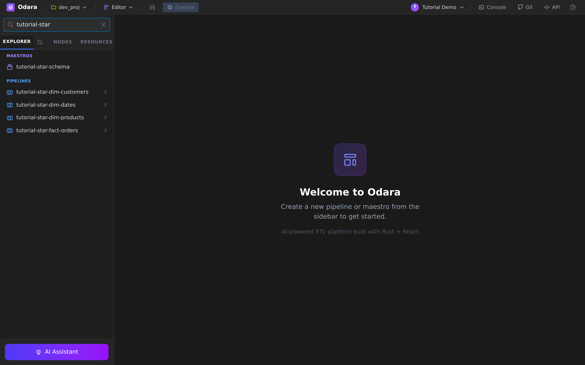

```
                    Maestro: tutorial-star-schema
                    └── Parallel Group: "Load star schema"
                          ├── tutorial-star-dim-customers
                          ├── tutorial-star-dim-products
                          ├── tutorial-star-dim-dates
                          └── tutorial-star-fact-orders
```

Each child is a tiny two-node pipeline: `CSV Source → Snowflake
Target`. Splitting the work this way (instead of one mega-pipeline
with four branches) means:

- Each table can be re-run, retried, or scheduled **independently**.
- The Maestro is the only place that knows about ordering — swap
  parallel for sequential without touching any pipeline.
- Failures are scoped: if `fact_orders` fails, the dim loads still
  succeed and you don't redo their work.

---

## 2. A dimension pipeline

Open `tutorial-star-dim-customers` from the sidebar — two nodes:

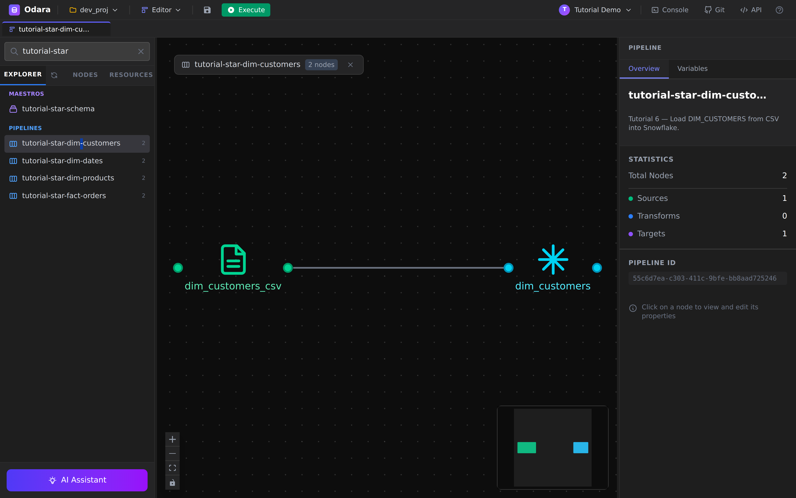

The CSV source is identical to anything you've done before — path,
delimiter, has-header. Nothing Snowflake-specific.

### The Snowflake Target

Click the Snowflake node on the right of the canvas:


Snowflake is the only target that **has no `connection_string`** —
the seven fields *are* the configuration. Fill in every one with
your account's values:

| Field | What goes in |
|---|---|
| **Account** | Your Snowflake account locator (everything before `.snowflakecomputing.com`). |
| **Warehouse** | A compute warehouse the role can use. XS suspends in 60 s. |
| **Database** | The target database. |
| **Schema** | The target schema (commonly `PUBLIC` on a fresh account). |
| **Username** | Snowflake user. |
| **Password** | The user's password. Stored encrypted at rest with AES-GCM; once saved, the field shows `●●●●●●`. |
| **Role** | A role with `USAGE` on warehouse + `CREATE TABLE` on schema. |
| **Table Name** | `DIM_CUSTOMERS`. Snowflake uppercases unquoted identifiers, so keep your table names **UPPER_SNAKE** to avoid surprises later. |
| **Table Operation (DDL)** | `Drop & Create` — drops the table if it exists and recreates from the Arrow schema. Idempotent re-runs. |
| **Data Operation (DML)** | `Insert` for the demo. Switch to **`Copy Into`** for production loads — it stages on the Snowflake side and bulk-loads, **20–100× faster** than row-by-row INSERTs for anything > 10k rows. |

Repeat for `dim_products` and `dim_dates`. Same shape every time, two
fields change (CSV path + Table Name). That is the whole point of
the maestro pattern — children are clones with tiny variations.

---

## 3. The fact pipeline

Open `tutorial-star-fact-orders`:

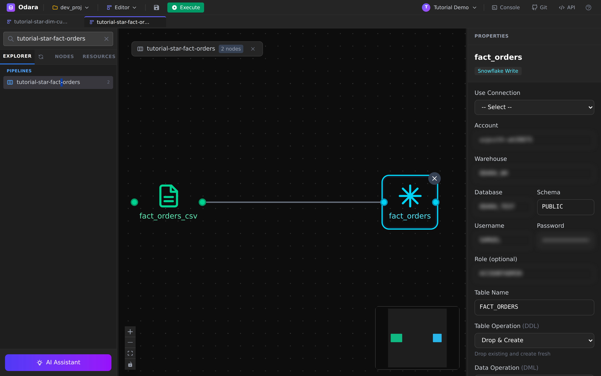

Structurally **identical** to the dim pipelines — `CSV Source →
Snowflake Target`. The only differences are cosmetic:

- **CSV path** → `fact_orders.csv` (100 rows vs 10–30 for the dims).
- **Table Name** → `FACT_ORDERS`.

The fact CSV's columns are deliberately *foreign-key shaped* —
`customer_key`, `product_key`, `date_key`, `quantity`, `total_amount`
— pointing into the three dim tables. **Snowflake does not enforce
foreign keys** (they're "informational" only), but the data still
follows the convention; if you point a BI tool at this schema, it
will discover the joins from column-name overlap or explicit
metadata.

### About loading order

For the demo we load **all four in parallel** because Snowflake
doesn't enforce FKs — the order doesn't matter. **In production**
with a database that *does* enforce FKs (Postgres, MySQL), you'd
load **dimensions first, then the fact** to satisfy the constraints.
You'd model that with two sequential Maestro steps: a Parallel
Group of dim loads, followed by a single Pipeline Call for the
fact. We'll see Maestro steps next.

---

## 4. Build the Maestro — step by step

Now we build the orchestrator from scratch. **Do not double-click
the existing `tutorial-star-schema`** — we'll create a fresh one so
you can see every step.

### 4.1 — Create a new Maestro

Right-click the **MY MAESTROS** section header in the left sidebar.
A small context menu opens:

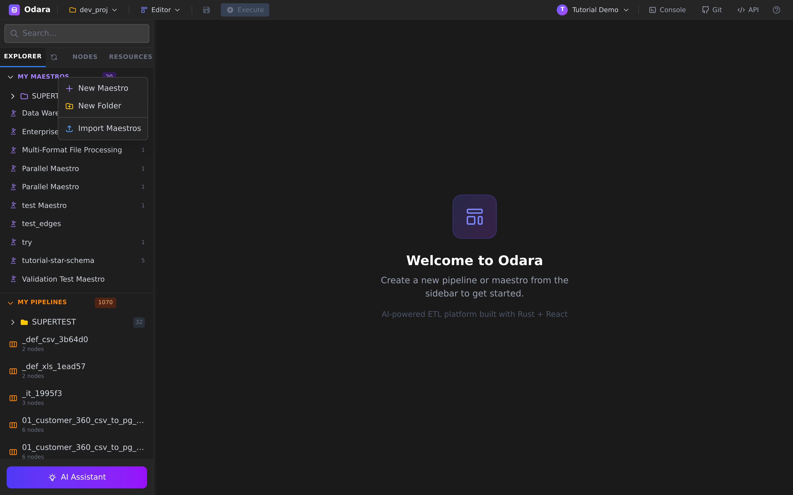

Click **New Maestro**. A new entry appears in the sidebar called
*"New Maestro"* and the canvas switches to it.

### 4.2 — The empty canvas + Steps palette

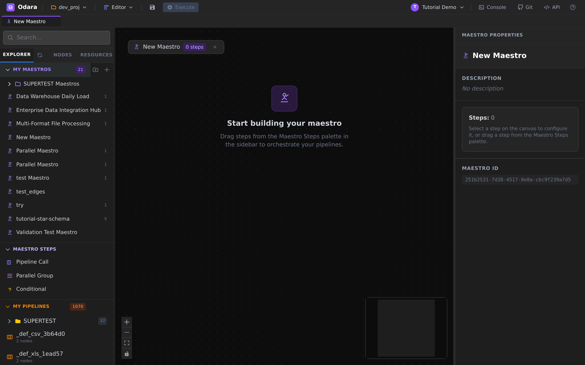

Two things to notice on this screen:

- **Centre canvas** says *"Start building your maestro — Drag steps
  from the Maestro Steps palette in the sidebar to orchestrate your
  pipelines."*
- **Left sidebar** has a new section near the bottom called
  **MAESTRO STEPS** with three items:
  - **Pipeline Call** — invoke a single pipeline
  - **Parallel Group** — run nested steps concurrently
  - **Conditional** — `if … then … else …` over a condition string

The right-side **MAESTRO PROPERTIES** panel shows the maestro's
top-level metadata: name, description, step count (`0` for now),
and the **Maestro ID** (UUID — handy for `gh` or API references).

### 4.3 — Drag a Parallel Group

Grab **Parallel Group** from the palette and drag it onto the
canvas. Release the mouse somewhere in the middle.

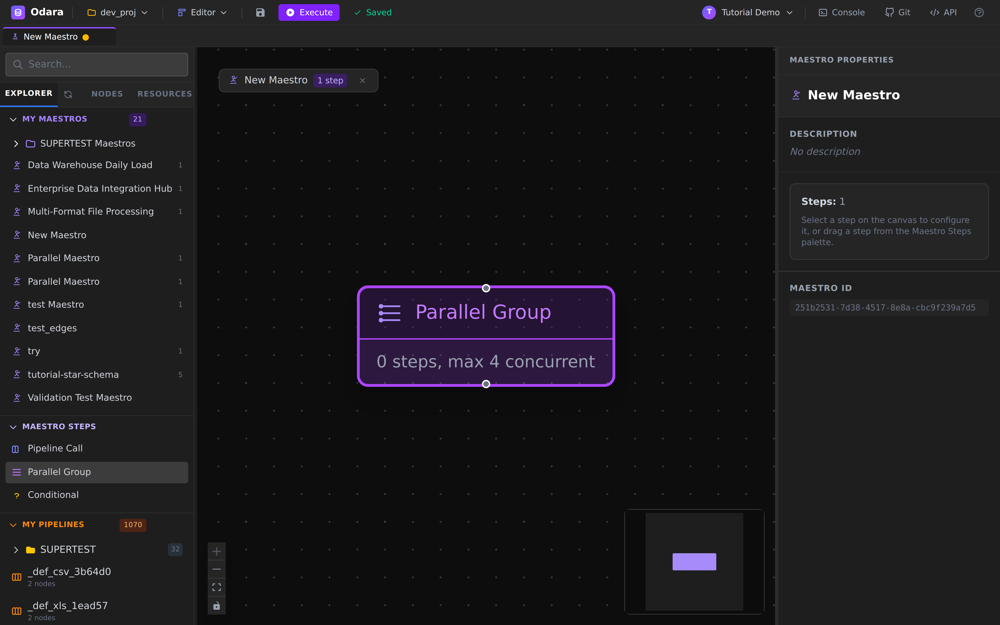

A single rounded block appears, captioned *"Parallel Group — 0
steps, max 4 concurrent"*. The top tab shows **1 step** and the
toolbar reads ✓ **Saved** — Maestros auto-save on every change, no
explicit save button.

Click the Parallel Group itself to open its **STEP PROPERTIES**:

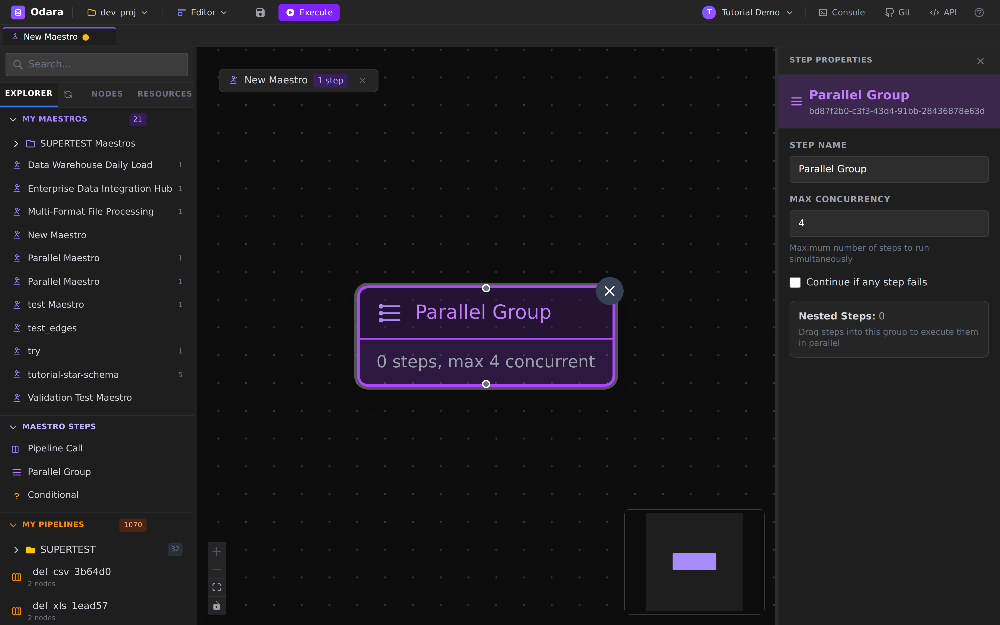

Two knobs that matter:

- **Max concurrency** — how many child steps can run at the same
  time. The default is **4**. Lower it (say `2`) to stagger the load
  on a tiny warehouse; raise it for big fan-outs.
- **Continue if any step fails** — when checked, a child failure
  doesn't short-circuit the group. Default is **off** (fail fast,
  good for star-schema loads where you want to retry the whole
  thing).

We'll leave both at their defaults.

### 4.4 — Drag a Pipeline Call into the group

Now drag **Pipeline Call** from the palette and drop it inside or
just below the Parallel Group:

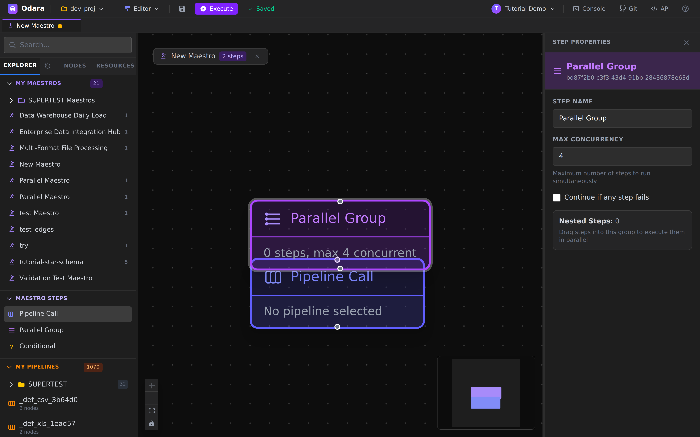

The tab counter at the top is now **2 steps** — the Parallel Group
plus its child. The new child reads *"Pipeline Call — No pipeline
selected"*.

### 4.5 — Pick the pipeline

Click the new **Pipeline Call** card. The properties panel now shows
its config:

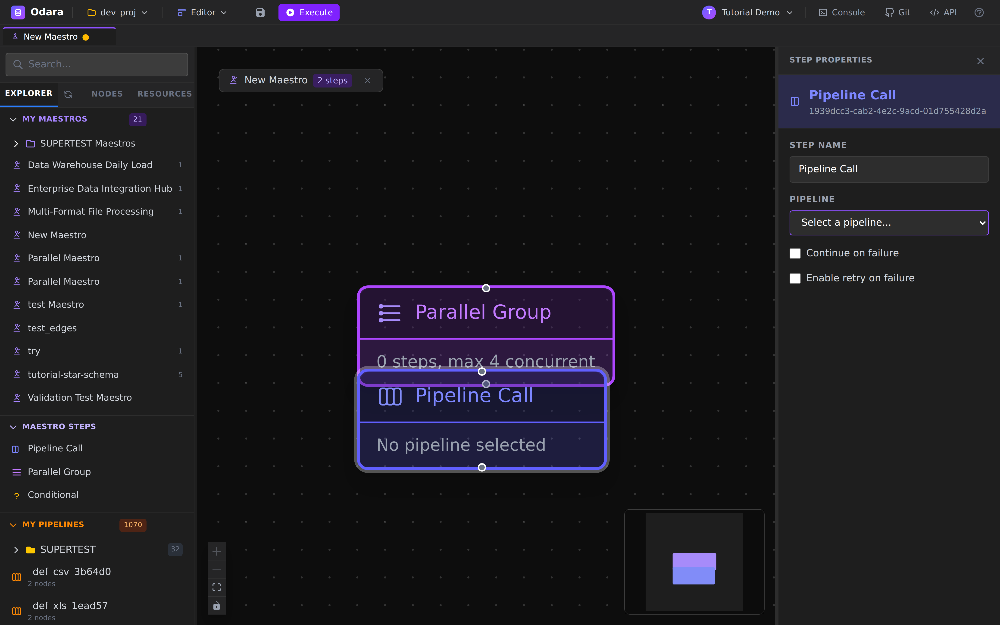

| Field | What goes in |
|---|---|
| **Step Name** | The label you see on the canvas (we'll rename to `Load DIM_CUSTOMERS`). |
| **Pipeline** | A dropdown of every pipeline in the project. Pick `tutorial-star-dim-customers`. |
| **Continue on failure** | If checked, a failure of *this child* doesn't fail the group. Independent of the group's own setting. |
| **Enable retry on failure** | Tick it to retry the child a few times before surrendering — useful for transient Snowflake "warehouse suspended" errors. |

### 4.6 — Repeat for the other three children

Drag three more **Pipeline Call** steps into the same Parallel
Group, naming them and picking the right pipeline:

| Step Name | Pipeline |
|---|---|
| `Load DIM_CUSTOMERS` | `tutorial-star-dim-customers` |
| `Load DIM_PRODUCTS`  | `tutorial-star-dim-products`  |
| `Load DIM_DATES`     | `tutorial-star-dim-dates`     |
| `Load FACT_ORDERS`   | `tutorial-star-fact-orders`   |

You should now have **5 steps** total — one Parallel Group + four
nested Pipeline Calls. The end-state matches the `tutorial-star-
schema` maestro shipped with the demo:

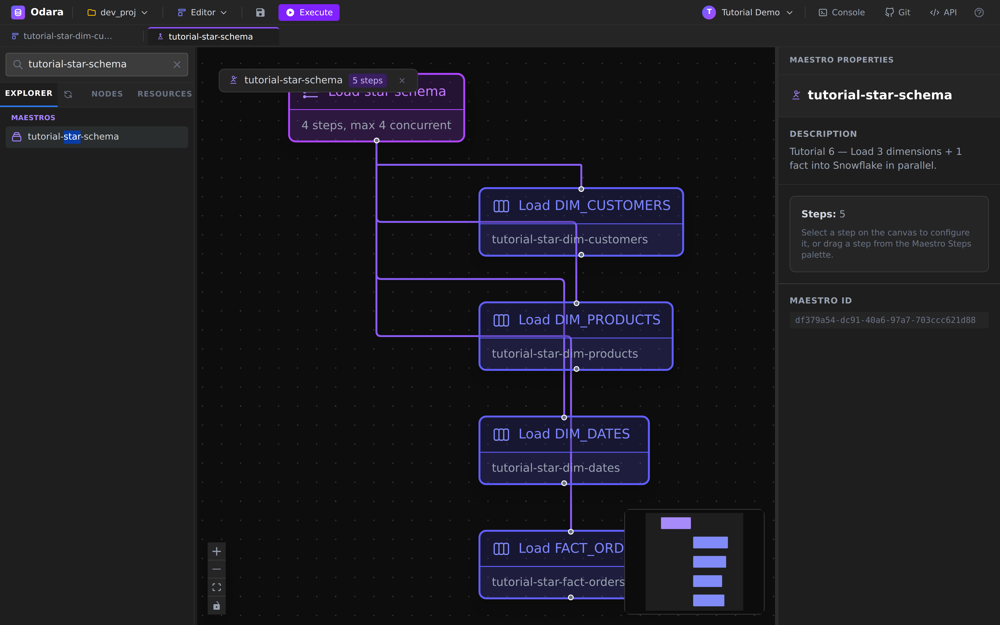

Don't forget to rename the maestro itself from *"New Maestro"* to
something meaningful (`tutorial-star-schema-mycopy`, say) by
clicking its title in the **MAESTRO PROPERTIES** panel and typing.

---

## 5. Execute

Hit **Execute** in the toolbar.

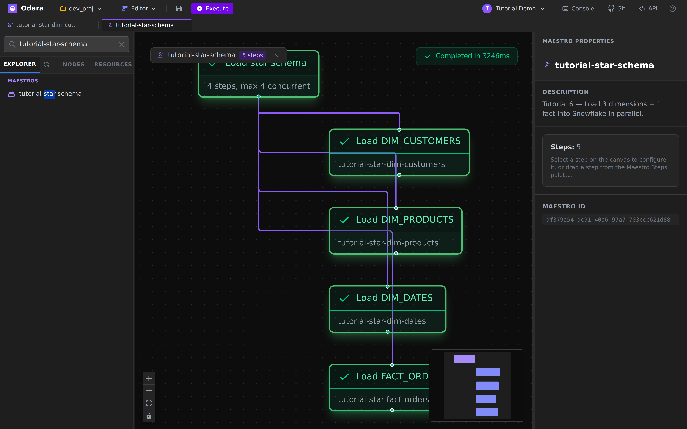

Behind the scenes the Maestro executor:

1. Spawns four async tasks (one per `pipeline_call`).
2. Each task POSTs `/api/v1/pipelines/<child_id>/run-stream` against
   the API.
3. Joins when all four finish (or one errors, if
   `continue_on_failure = false`).

---

## 6. Watch it in Monitor

Switch to **Monitor**. Filter by `tutorial-star` and you'll see five
fresh entries — four pipeline runs **plus** the parent Maestro run.

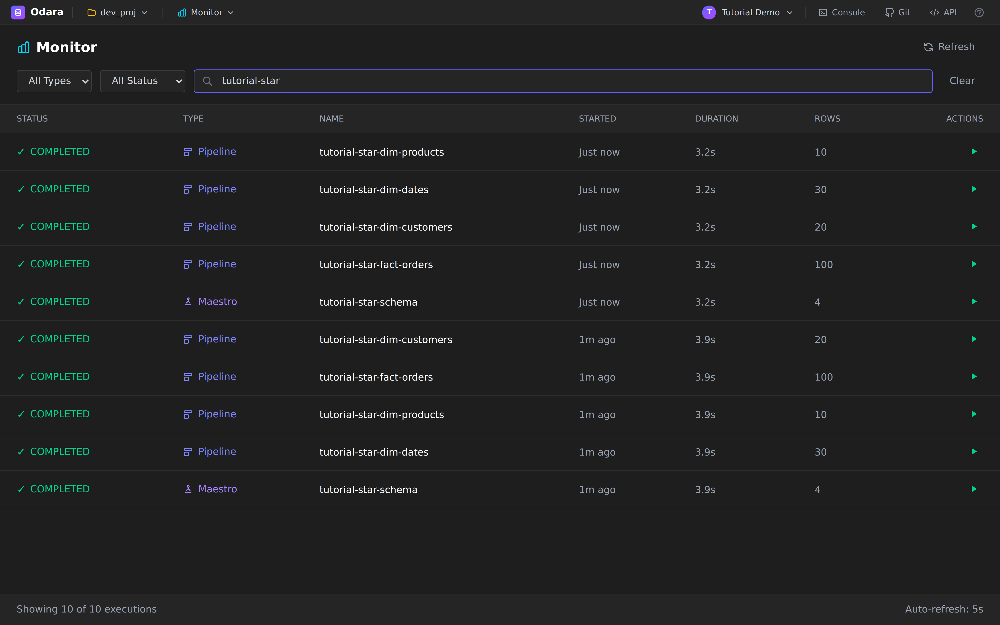

A few things to read off this list:

- **Type** column lets you separate `Pipeline` from `Maestro` at a
  glance — useful when a maestro orchestrates dozens of children.
- **Started: Just now** on all five — confirms they really started
  concurrently.
- **Duration: 3.2s** for every row — the wall-clock is dominated by
  Snowflake INSERT round-trips; CPU/network on Odara's side is
  negligible.
- **Rows** — each child shows its own row count (20 dim_customers,
  10 dim_products, 30 dim_dates, 100 fact_orders); the Maestro row
  shows `4` (= number of child pipelines).

Click the **Maestro** row to see the orchestration trace:

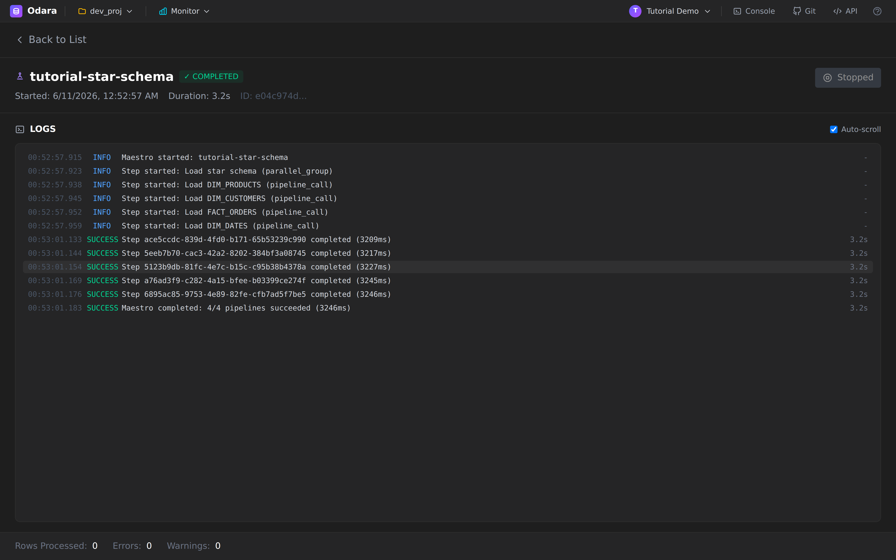

Read it top to bottom:

- `Maestro started: tutorial-star-schema`
- `Step started: Load star schema (parallel_group)` — the parent
- `Step started: Load DIM_PRODUCTS / DIM_CUSTOMERS / FACT_ORDERS / DIM_DATES (pipeline_call)` — all four fire in the same millisecond
- four `SUCCESS Step …` lines, each with its individual duration
  (3.2s ± a few ms)
- `SUCCESS Maestro completed: 4/4 pipelines succeeded (3246ms)`

The children are **interleaved** (DIM_PRODUCTS shows up first, not
DIM_CUSTOMERS) — that's a real signal of parallel execution: the OS
scheduler decides which Tokio task gets its first slice.

---

## 7. Where the JOINs happen

This is the question the star schema exists to answer: **the joins
happen at query time, in Snowflake — not in the load pipelines.**

Our four pipelines each load **one table, fully independent of the
others**. The Odara executor never opens both `customers` and
`orders` in the same memory at the same time. The "star" is just a
*shape on disk*; the magic is what BI tools do with it when they
query.

When an analyst opens a dashboard, the SQL the BI tool generates is
a star join:

```sql
USE WAREHOUSE <your_warehouse>;
USE DATABASE  <your_database>;
USE SCHEMA    PUBLIC;

SELECT
  d.month_name,
  c.country,
  p.category,
  SUM(f.total_amount) AS revenue
FROM FACT_ORDERS f
JOIN DIM_CUSTOMERS c ON c.customer_key = f.customer_key
JOIN DIM_PRODUCTS  p ON p.product_key  = f.product_key
JOIN DIM_DATES     d ON d.date_key     = f.date_key
GROUP BY 1, 2, 3
ORDER BY revenue DESC
LIMIT 10;
```

Three JOINs, one fact, three dims. Each `JOIN` matches the fact's
`*_key` column against the same-named key in the dim. The grouping
columns come from the dim sides (human-readable `month_name`,
`country`, `category`); the measure (`SUM(total_amount)`) comes from
the fact side.

This is why we built the schema as a star in the first place:

- **Wide dimension tables** with the descriptive attributes —
  written once.
- **Narrow fact table** with measurements + foreign keys — appended
  often.
- **Joins computed at read time** by the warehouse's SQL engine,
  which has all the indexes and statistics to do it well.

### Quick row-count sanity check

Run this first to confirm the loads landed:

```sql
SELECT 'DIM_CUSTOMERS' AS table_name, COUNT(*) AS rows FROM DIM_CUSTOMERS
UNION ALL SELECT 'DIM_PRODUCTS', COUNT(*) FROM DIM_PRODUCTS
UNION ALL SELECT 'DIM_DATES',    COUNT(*) FROM DIM_DATES
UNION ALL SELECT 'FACT_ORDERS',  COUNT(*) FROM FACT_ORDERS;
```

Expected:

| table_name | rows |
|---|---|
| DIM_CUSTOMERS | 20 |
| DIM_PRODUCTS | 10 |
| DIM_DATES | 30 |
| FACT_ORDERS | 100 |

If the row counts match, the star is loaded.

---

## Cheat sheet

| I want to… | Do this |
|---|---|
| Create a new Maestro | Right-click **MY MAESTROS** → **New Maestro** |
| Add a step | Drag from **MAESTRO STEPS** palette onto canvas |
| Make N children run together | One **Parallel Group**, drop the children inside, set **Max concurrency = N** |
| Make children run one after another | Add them as **top-level** steps (no Parallel Group) — sequential is the default |
| Mix: dims parallel, then fact | Parallel Group for the three dims, then a sibling Pipeline Call for the fact |
| Limit concurrency (small warehouse) | Parallel Group → **Max concurrency** = lower number |
| Keep going if one child fails | Parallel Group → **Continue if any step fails** |
| Retry transient failures | Pipeline Call → **Enable retry on failure** |
| Idempotent re-runs of the loads | Snowflake Target → **Table Operation = Drop & Create** |
| Fast bulk loads (> 10k rows) | Snowflake Target → **Data Operation = Copy Into** |

---

## What you learned

- A **star schema load** doesn't need one giant pipeline — model it
  as one pipeline per table and let a **Maestro** be the only place
  that knows about ordering.
- The **Snowflake Target** has no connection string — its seven
  configuration fields *are* the connection, and the password is
  encrypted at rest.
- A **Parallel Group** with `Max concurrency = N` actually runs the
  children concurrently — Monitor's `Started: Just now` on every row
  and interleaved `Step completed` lines are how you can tell.
- **JOINs happen at query time**, in the warehouse — the load is
  four independent streams. The "star" is just the on-disk shape
  that makes the read-time JOIN cheap.
- For production loads, swap **`Insert`** → **`Copy Into`** on the
  Snowflake target — same UI, dramatically faster on real volumes.

That closes the first six walkthroughs. From here every pipeline you
build is a remix: connectors, transforms, schedules, alerts,
orchestration — you've seen the building blocks.
